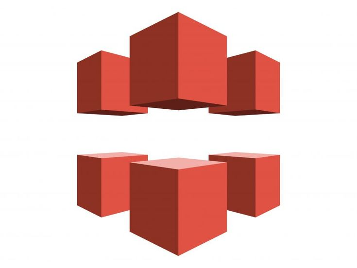

## AWS Services Used

---

### AWS Web Application Firewall

AWS WAF is a security service from AWS that helps protect web applications against common attacks such as SQL injection, Cross-site scripting (XSS), DDos...

### Amazon CloudFront

Amazon CloudFront is a Content Delivery Network (CDN) service that securely delivers data with low latency and high transfer speed.

---

### Amazon S3

Amazon S3 (Simple Storage Service) is an object storage service that allows flexible, secure, and highly scalable data storage and retrieval. It is commonly used to store images, videos, backups, or static website content.

---

### AWS IAM

AWS IAM (Identity and Access Management) is a service for managing users and access permissions within the AWS ecosystem. It allows you to create users, groups, and roles, and assign policies to securely control access to resources.

---

### AWS Elastic Beanstalk

AWS Elastic Beanstalk helps you deploy and manage web applications automatically. Simply upload your source code, and Beanstalk will handle infrastructure configuration, load balancing, auto-scaling, and application monitoring.

---

### AWS RDS

AWS RDS (Relational Database Service) is a managed relational database service that supports various engines like MySQL, PostgreSQL, SQL Server, and Oracle. It simplifies deployment, operation, backup, security, and scaling of relational databases.

---

### AWS Backup

AWS Backup is a service for automating backup and recovery across multiple AWS services such as EBS, RDS, DynamoDB, S3, etc. It offers centralized backup management, scheduling, policy control, and ensures compliance with security requirements.
