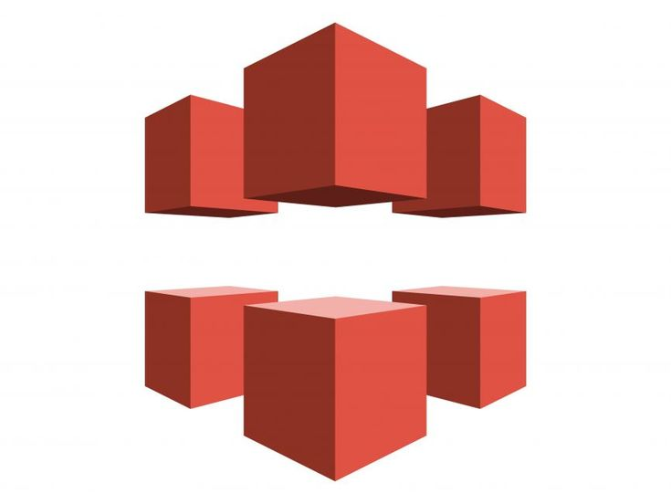
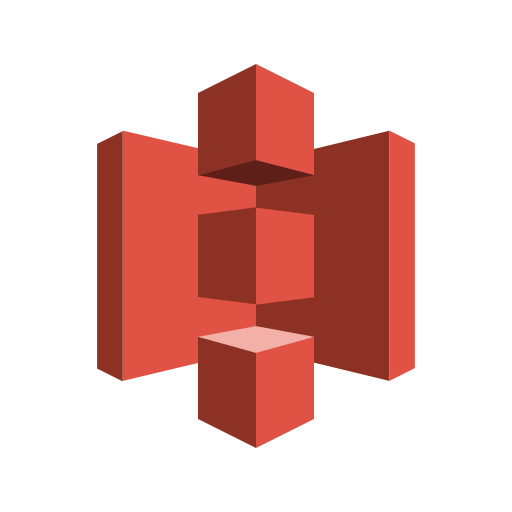
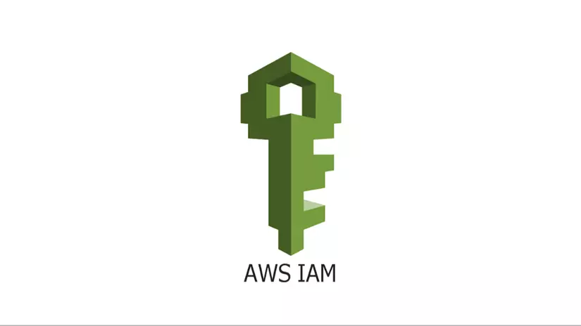
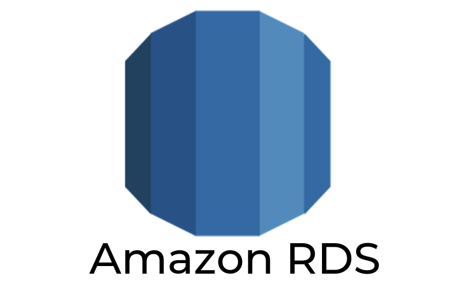

## Các dịch vụ AWS sử dụng

---

### AWS Web Application Firewall

AWS WAF là một dịch vụ bảo mật của AWS giúp bảo vệ các ứng dụng web khỏi các cuộc tấn công phổ biến như SQL injection, Cross-site scripting (XSS), DDos...

### Amazon CloudFront

Amazon CloudFront là dịch vụ mạng phân phối nội dung (CDN) giúp truyền tải dữ liệu một cách an toàn, với độ trễ thấp và tốc độ cao.

---

### Amazon S3

Amazon S3 (Simple Storage Service) là dịch vụ lưu trữ đối tượng, cho phép lưu và truy xuất dữ liệu một cách linh hoạt, an toàn và có khả năng mở rộng cao. S3 thường được sử dụng để lưu trữ ảnh, video, dữ liệu sao lưu, hoặc nội dung tĩnh của website.

---

### AWS IAM

AWS IAM (Identity and Access Management) là dịch vụ quản lý người dùng và quyền truy cập trong hệ sinh thái AWS. IAM cho phép tạo người dùng, nhóm, vai trò và gán chính sách để kiểm soát truy cập đến các tài nguyên một cách bảo mật.

---

### AWS Elastic Beanstalk

AWS Elastic Beanstalk giúp triển khai và quản lý ứng dụng web một cách tự động. Người dùng chỉ cần upload mã nguồn, còn lại Beanstalk sẽ xử lý cấu hình hạ tầng, cân bằng tải, mở rộng tự động và giám sát ứng dụng.

---

### AWS RDS

AWS RDS (Relational Database Service) là dịch vụ cơ sở dữ liệu quan hệ được quản lý bởi AWS, hỗ trợ nhiều hệ quản trị như MySQL, PostgreSQL, SQL Server và Oracle. RDS giúp triển khai, vận hành, sao lưu, bảo mật và mở rộng cơ sở dữ liệu một cách dễ dàng.

---

### AWS Backup

AWS Backup là dịch vụ tự động sao lưu và phục hồi dữ liệu cho nhiều dịch vụ AWS như EBS, RDS, DynamoDB, S3, v.v. Dịch vụ này cung cấp khả năng quản lý tập trung, lập lịch sao lưu, kiểm soát chính sách lưu trữ và đảm bảo tuân thủ các yêu cầu bảo mật.
