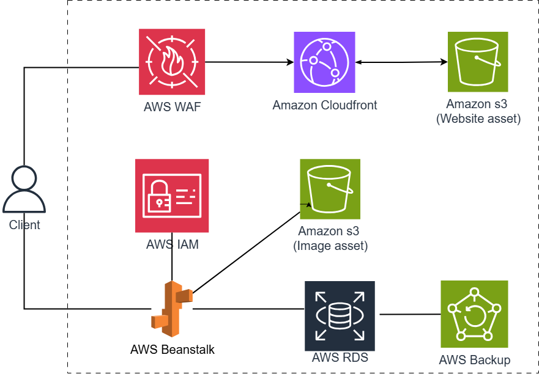

## Architecture Overview

The system is designed based on **microservices** and **cloud-native** principles, leveraging AWS managed services. This approach minimizes infrastructure management and allows developers to focus on implementing business logic.

---

## 3-Tier Architecture

The application follows a **3-tier architecture**, consisting of:

---

### 1. Presentation Tier – User Interface

This tier uses the following services to host the static website:

- **AWS CloudFront**  
  Delivers static content (HTML, CSS, JS) from Amazon S3 to end users.

- **AWS S3**  
  Hosts the static website — the built ReactJS application.

---

### 2. Application Tier – Business Logic

This tier processes the business logic using AWS services:

- **AWS Elastic Beanstalk**  
  Automatically deploys and manages the server-side application written in Spring Boot.

- **AWS IAM**  
  Provides secure permissions for Elastic Beanstalk to access RDS and S3.

---

### 3. Data Tier – Data Storage

This tier includes the following services:

- **Amazon RDS (MySQL)**  
  Stores business data using the MySQL relational database engine.

- **AWS S3**  
  Stores files such as images uploaded by users.

- **AWS Backup**  
  Automatically backs up data from Amazon RDS to ensure recovery in case of failures.

---

### 🔧 Additional Supporting AWS Services

- **Amazon SES**  
  Sends email notifications to users (e.g., registration confirmations, password resets).

- **AWS CloudWatch**  
  Monitors system performance, logs activities, and sends alerts from services like Lambda, API Gateway, DynamoDB, and SES.

---

## System Workflow

1. Users access the website via the CloudFront endpoint.
2. CloudFront receives the request and checks whether the frontend files are already cached at the edge location:
   - If cached → returns them directly.
   - If not → fetches files from Amazon S3 and returns them to the user.
3. Once the UI is loaded, the website sends API (HTTP) requests to the backend hosted on Elastic Beanstalk.
4. Elastic Beanstalk handles the requests and connects to Amazon RDS to retrieve or store data.
