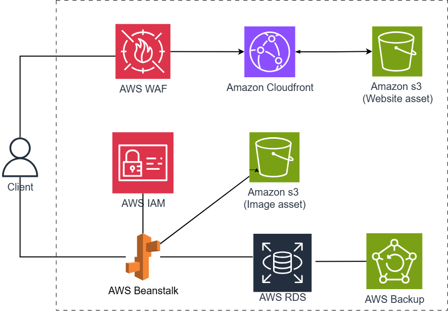

## Tổng quan kiến trúc

Hệ thống được thiết kế theo nguyên tắc **microservices** và **cloud-native**, sử dụng các dịch vụ được quản lý sẵn của AWS. Điều này giúp giảm thiểu công việc quản trị hạ tầng, cho phép tập trung vào phát triển logic nghiệp vụ.

---

## Kiến trúc 3 lớp

Ứng dụng sử dụng kiến trúc **3-tier layers**, bao gồm:

---

### 1. Presentation Tier – Giao diện người dùng

Sử dụng các dịch vụ sau để triển khai trang web tĩnh:

- **AWS WAF**
  Bảo vệ các ứng dụng web khỏi các cuộc tấn công phổ biến như SQL injection, Cross-site scripting (XSS), DDos...
- **AWS CloudFront**  
  Phân phối nội dung tĩnh (HTML, CSS, JS) từ Amazon S3 đến người dùng cuối.

- **AWS S3**  
  Lưu trữ website tĩnh — chính là ứng dụng ReactJS đã được build.

---

### 2. Application Tier – Xử lý nghiệp vụ

Sử dụng các dịch vụ AWS để xử lý logic nghiệp vụ:

- **AWS Elastic Beanstalk**  
  Triển khai ứng dụng server-side được viết bằng Spring Boot một cách tự động, dễ quản lý.

- **AWS S3**  
  Lưu trữ và truy vấn hình ảnh.

---

### 3. Data Tier – Lưu trữ dữ liệu

Sử dụng các dịch vụ sau:

- **Amazon RDS (MySQL)**  
  Lưu trữ dữ liệu nghiệp vụ với hệ quản trị cơ sở dữ liệu quan hệ MySQL.

- **AWS S3**  
  Lưu trữ các tệp tin như hình ảnh do người dùng tải lên.

- **AWS Backup**  
  Tự động sao lưu dữ liệu từ Amazon RDS để đảm bảo khả năng phục hồi khi có sự cố.

---

## Luồng hoạt động của hệ thống

1. Người dùng truy cập website thông qua CloudFront endpoint.
2. CloudFront tiếp nhận yêu cầu và kiểm tra xem các tệp frontend đã được cache ở edge location chưa:
   - Nếu có → trả về trực tiếp.
   - Nếu chưa → CloudFront lấy file từ Amazon S3 rồi trả về cho người dùng.
3. Sau khi tải xong giao diện, website sẽ gửi các request API (HTTP) đến backend đang chạy trên Elastic Beanstalk.
4. Elastic Beanstalk tiếp nhận yêu cầu và kết nối đến Amazon RDS để truy xuất hoặc lưu trữ dữ liệu.
