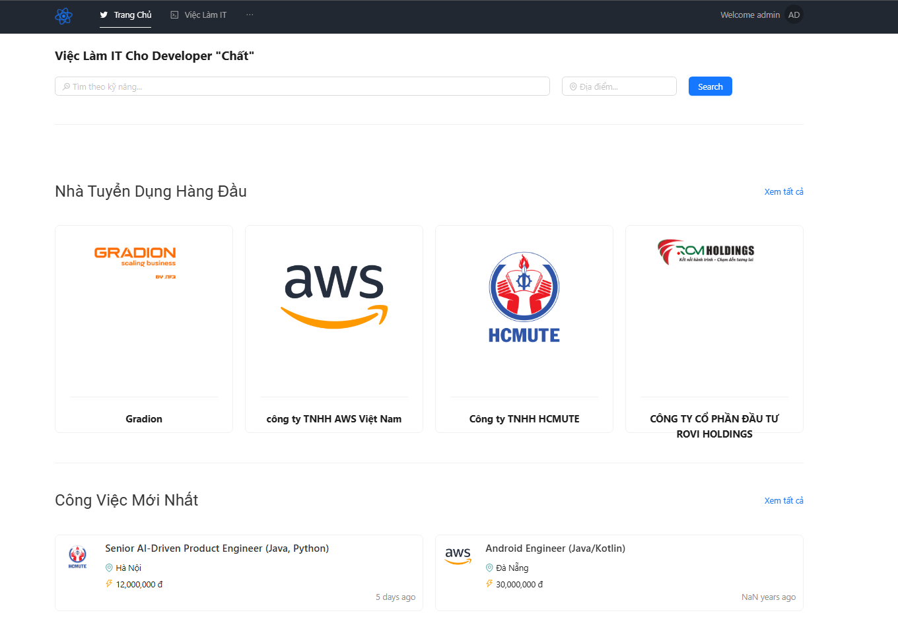

## Deployed Application

**JobSeeker** is a job-search web application developed using a modern architecture, featuring the following core functionalities:

---

### 🎯 Key Features

- **User Management**  
  Allows registration, login, and authentication using JWT.

- **Company Management**  
  Create and edit company profiles, including the ability to upload a company logo.

- **Job Management**  
  Post job listings, search for jobs, and submit applications.

- **Image Upload**  
  Store and manage user images using AWS S3.

---

### ⚠️ Note

This workshop is designed for educational purposes, so some features may not be fully implemented. The **main goal** is to help learners become familiar with the deployment and operation process on the AWS Cloud platform, rather than completing all business logic in the application.

### 📄 Copyright

The **JobSeeker** application is copyrighted by **Hỏi Dân IT**.

---
