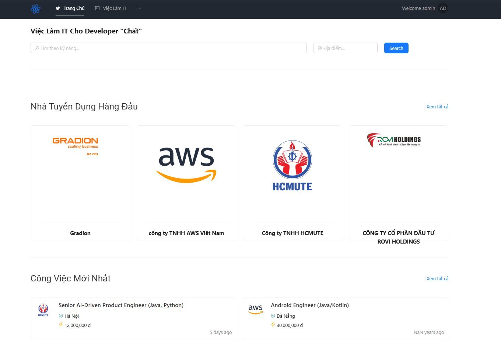

## Ứng dụng Triển khai

**JobSeeker** là một ứng dụng web tìm việc làm, được phát triển theo kiến trúc hiện đại với các tính năng chính sau:

---

### 🎯 Tính năng chính

- **Quản lý người dùng**  
  Cho phép đăng ký, đăng nhập và xác thực bằng JWT.

- **Quản lý công ty**  
  Tạo và chỉnh sửa thông tin công ty, bao gồm khả năng upload logo.

- **Quản lý việc làm**  
  Đăng tin tuyển dụng, tìm kiếm công việc và nộp hồ sơ ứng tuyển.

- **Upload hình ảnh**  
  Lưu trữ và quản lý hình ảnh người dùng thông qua dịch vụ AWS S3.

---

### ⚠️ Lưu ý

Workshop này được thực hiện trong quá trình học tập, vì vậy một số tính năng có thể chưa hoàn thiện. **Mục tiêu chính** là giúp người học làm quen với quy trình triển khai và vận hành hệ thống trên nền tảng AWS Cloud, không tập trung vào việc hoàn chỉnh toàn bộ nghiệp vụ của ứng dụng.

### 📄 Bản quyền

Ứng dụng **JobSeeker** là sản phẩm thuộc bản quyền của tác giả **Hỏi Dân IT**.

---
