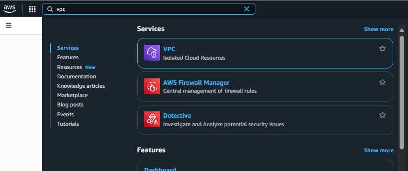
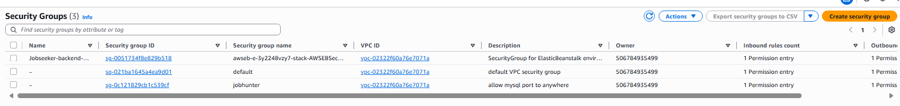
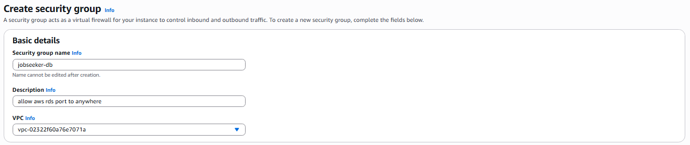
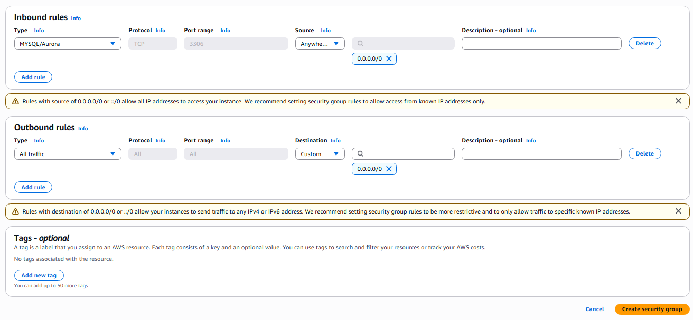
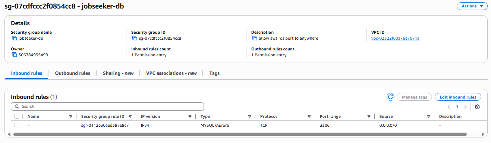

## Create a New Security Group

1. Go to the **AWS Management Console** homepage at [https://aws.amazon.com/](https://aws.amazon.com/)

2. Search for and select the **VPC** service.

3. In the VPC Dashboard, select **Security Groups**.

4. Click the **Create Security Group** button to create a new one.

5. In the **Basic Details** section, fill in the following information:

   - **Security group name**: `jobseeker-db`
   - **Description**: `Allow RDS port to anywhere`
   - **VPC**: Select the default VPC

6. Add a new **Inbound Rule**:

   - **Type**: `MySQL/Aurora`
   - **Source**: `Anywhere - IPv4`

> Note: Leave the **Outbound Rules** as default.

7. Click **Create Security Group** to finish.

---

### Result After Successfully Creating the Security Group:

