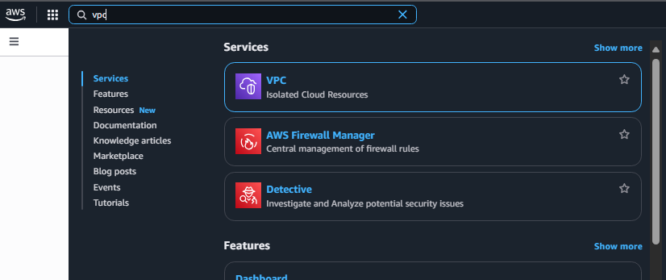
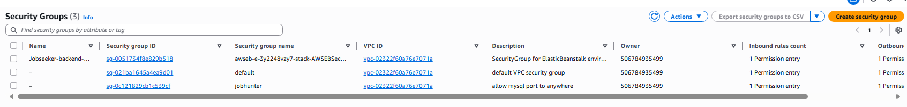
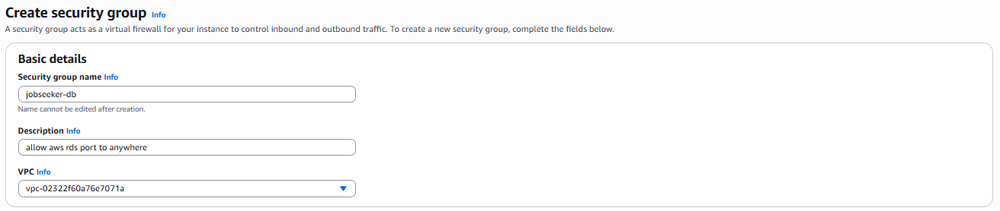
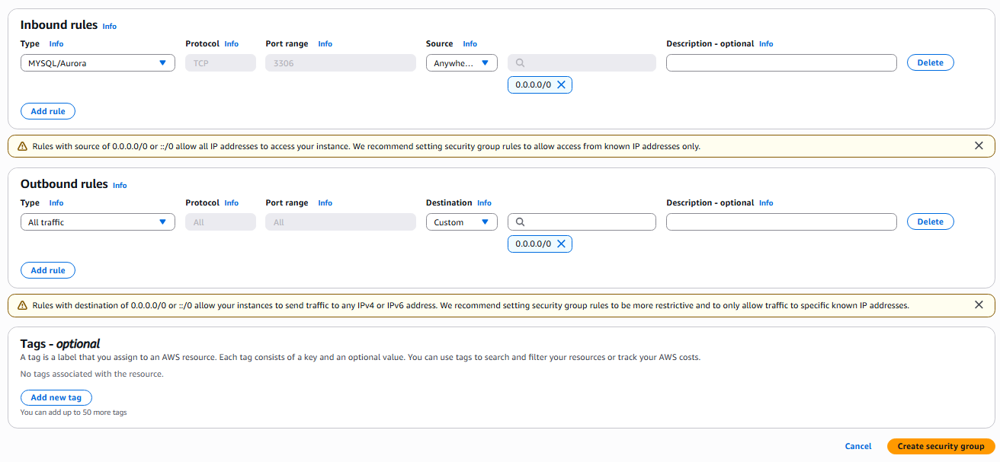
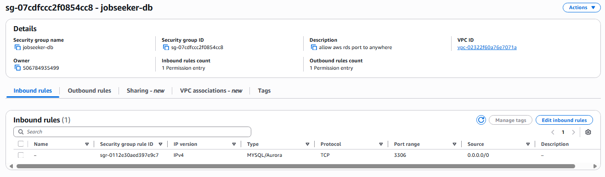

## Tạo 1 Security Group mới

1. Truy cập trang chủ **AWS Management Console** tại [https://aws.amazon.com/](https://aws.amazon.com/)

2. Tìm kiếm và chọn dịch vụ **VPC**.

3. Trong bảng điều khiển VPC (VPC Dashboard), chọn **Security Groups**.

4. Nhấn nút **Create Security Group** để tạo mới.

5. Trong phần **Basic Details**, điền thông tin như sau:

   - **Security group name**: `jobseeker-db`
   - **Description**: `Allow RDS port to anywhere`
   - **VPC**: Chọn VPC mặc định (default VPC)

6. Thêm một **Inbound Rule** mới:

   - **Type**: `MySQL/Aurora`
   - **Source**: `Anywhere - IPv4`

> Lưu ý: **Outbound Rules** để mặc định.

7. Nhấn **Create Security Group** để hoàn tất.

---

### Kết quả sau khi tạo thành công Security Group:

