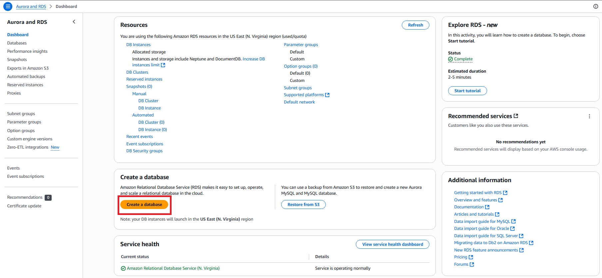
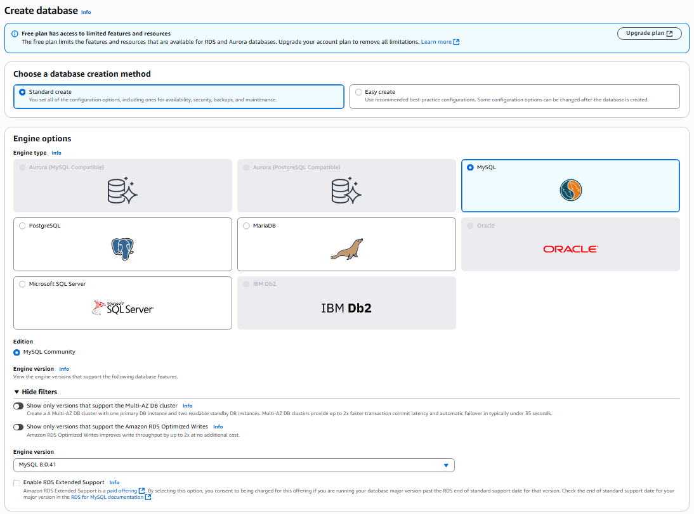
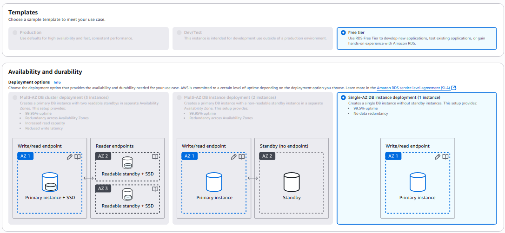
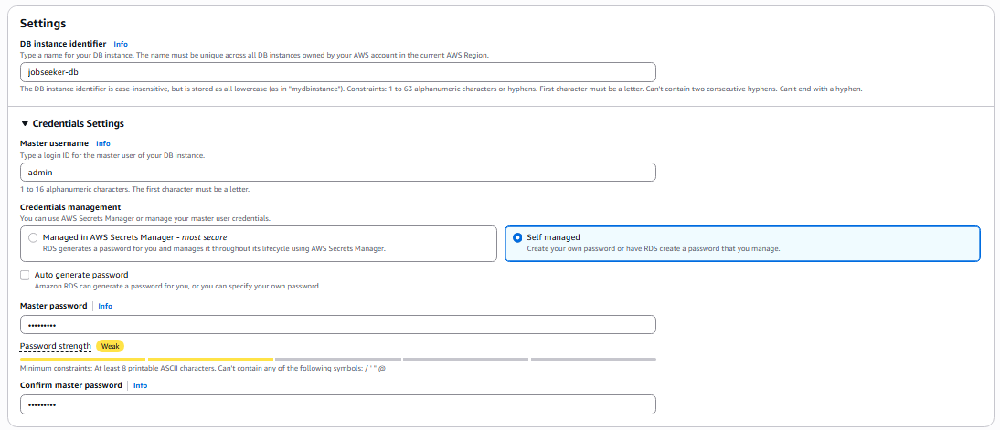

## Create a New Database with Amazon RDS

1. Go to the **AWS Management Console** at [https://aws.amazon.com/](https://aws.amazon.com/)

2. Search for and select the **RDS** or **Aurora and RDS** service.

3. Click the **Create a database** button.

4. In the **Create database** section, configure the following settings:

   - **Database creation method**: `Standard Create`
   - **Engine type**: `MySQL`
   - **Engine version**: `8.0.41`
   - **RDS Extended Support**: **Off**

5. **Template** and **Availability & Durability**:

   - Leave as default (Free Tier will be used)

6. **Settings**:

   - **DB instance identifier**: `jobseeker-db`
   - **Master username**: `admin`
   - **Credential management**: `Self-managed`
   - **Master password**: `Admin2025` (or a stronger password of your choice)

> ⚠️ Remember this information — it will be needed during backend configuration.

7. **Instance Configuration** and **Storage**:

   - Keep the default settings
   - You may reduce the allocated storage to **20 GB** as the lab does not require much

8. **Connectivity**:

   - **VPC**: Select the **default VPC**
   - **Security group**: Select the **Security Group created in the previous step**
   - **Public access**: Select **Yes**
   - Leave the remaining settings as default

9. Click **Create Database** to start the process.

---

### Result After Database Creation:

> ⚠️ Save the database endpoint — you will need it when configuring the backend.
