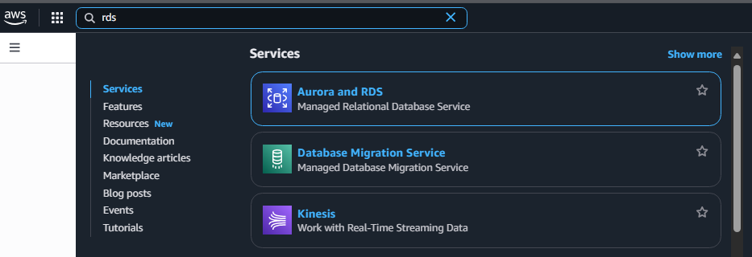
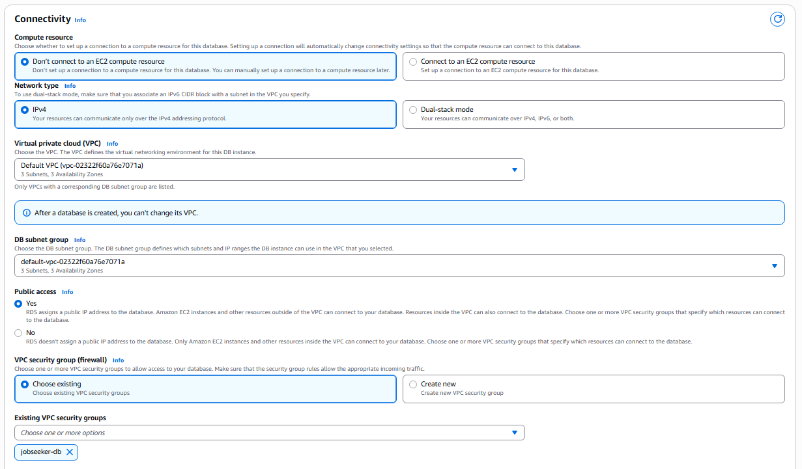

## Tạo một Database Mới với Amazon RDS

1. Truy cập **AWS Management Console** tại [https://aws.amazon.com/](https://aws.amazon.com/)

2. Tìm kiếm và chọn dịch vụ **RDS** hoặc **Aurora and RDS**.

3. Nhấn nút **Create a database**.

4. Trong phần **Create database**, cấu hình như sau:

   - **Database creation method**: `Standard Create`
   - **Engine type**: `MySQL`
   - **Engine version**: `8.0.41`
   - **RDS Extended Support**: **Tắt**

5. **Template** và **Availability & Durability**:

   - Để mặc định vì sử dụng gói **Free tier**.

6. **Settings**:

   - **DB instance identifier**: `jobseeker-db`
   - **Master username**: `admin`
   - **Credential management**: `Self-managed`
   - **Master password**: `Admin2025` (hoặc sử dụng mật khẩu mạnh hơn)

> ⚠️ Ghi nhớ các thông tin này để sử dụng trong phần cấu hình backend sau.

7. **Instance configuration** và **Storage**:

   - Giữ các thiết lập mặc định.
   - Có thể giảm dung lượng xuống **20 GB** do bài lab không yêu cầu nhiều.

8. **Connectivity**:

   - **VPC**: Chọn **VPC mặc định**
   - **Security group**: Chọn **Security group đã tạo ở bước trước**
   - Các mục còn lại: Để mặc định

9. Nhấn **Create Database** để bắt đầu tạo.

---

### Kết quả sau khi tạo xong:

> ⚠️ Lưu database endpoint để sử dụng trong phần cấu hình backend.
