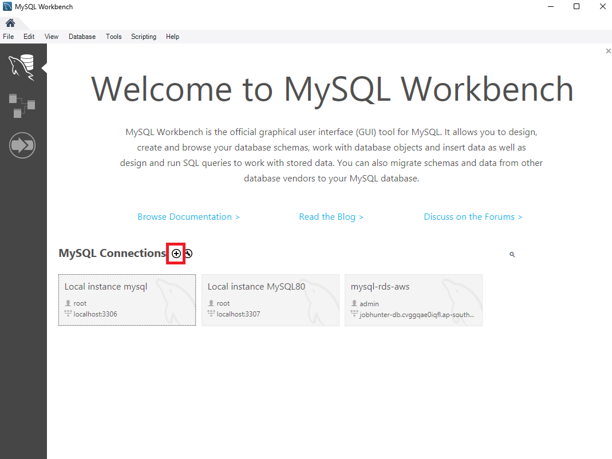
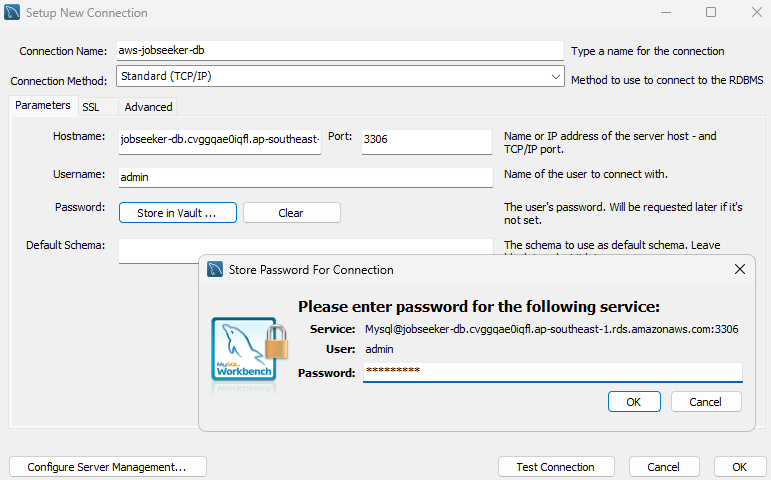
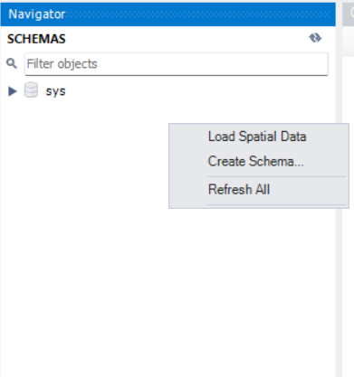
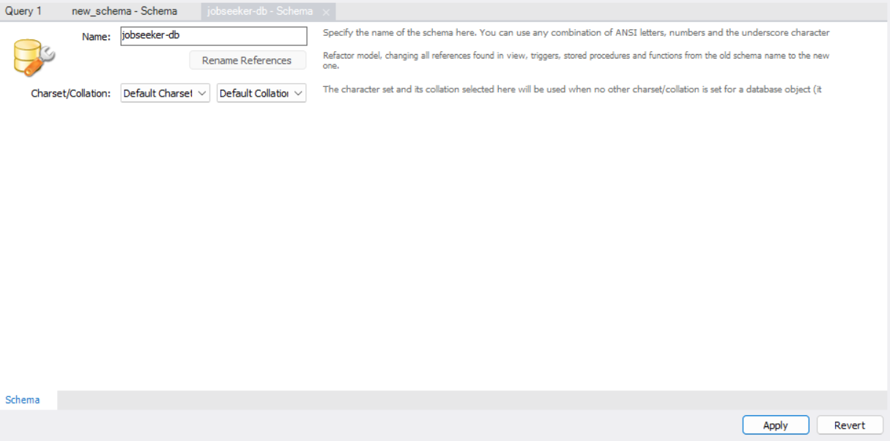

## Connect to MySQL Workbench

In MySQL Workbench, create a new connection by selecting **MySQL Connections** > **+ (Add Connection)**.

### Enter the following connection details:

- **Hostname**: your database endpoint (provided during RDS creation)
- **Username**: database username (`admin`)
- **Password**: database password (`Admin2025`)

After entering the information, click on the newly created connection to initiate it:

.png>)

✅ **Connection successful** if no errors occur and the database interface is displayed.

## Create a new schema in MySQL Workbench

1. Right-click and select **Create Schema..**

2. Enter schema name: **jobseeker-db**
3. Click **Apply**

> ⚠️ Save this schema name for use in the backend configuration later.
