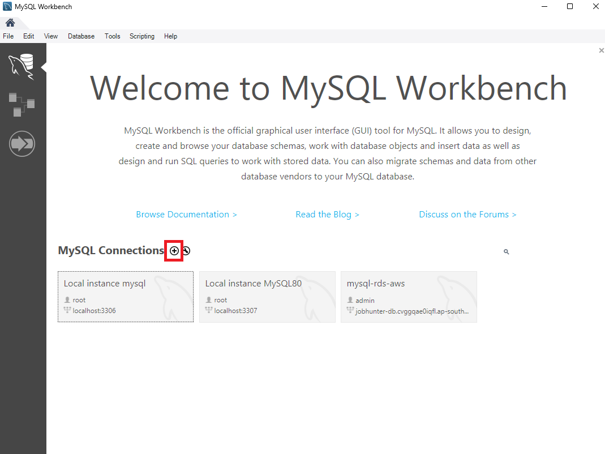

## Kết nối tới MySQL Workbench

Trong MySQL Workbench, tạo một kết nối mới bằng cách chọn **MySQL Connections** > **+ (Add Connection)**.

### Nhập các thông tin kết nối như sau:

- **Connection name**: tên connection (`aws-jobseeker-db`)
- **Hostname**: endpoint của database (được cung cấp khi tạo RDS)
- **Username**: tên người dùng cơ sở dữ liệu (`admin`)
- **Password**: mật khẩu của cơ sở dữ liệu (`Admin2025`)

Sau khi nhập đầy đủ thông tin, nhấn vào kết nối vừa tạo để bắt đầu kết nối:

.png>)

✅ **Kết nối thành công** nếu không có lỗi xảy ra và giao diện database được hiển thị.

## Tạo scheme mới trong MySQL Connection

1. Bấm chuột phải và chọn **Create Schema..**

2. Nhập tên scheme: **jobseeker-db**
3. Nhấn **apply**

> ⚠️ Lưu tên scheme này để sử dụng trong phần cấu hình backend sau.
