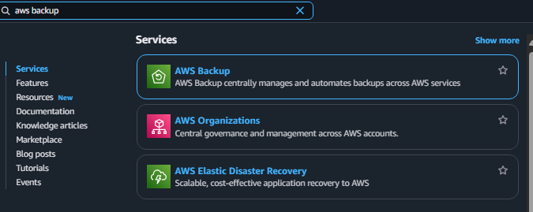
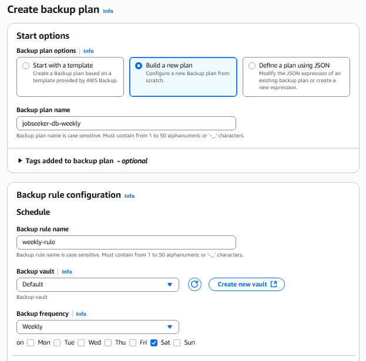
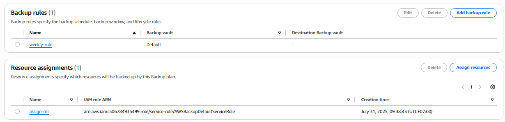

## Create AWS Backup

### 🔹 Step 1: Access AWS Backup Service

1. Open **AWS Management Console** at: [https://aws.amazon.com/](https://aws.amazon.com/)
2. Search for and select **AWS Backup** service.

---

### 🔹 Step 2: Create Backup Plan

3. Select **Backup plans** → click **Create backup plan**.
4. Configure the backup plan as follows:

   - **Backup plan options**: Build a new plan
   - **Backup plan name**: `jobseeker-db-weekly`
   - **Backup rule name**: `weekly-rule`
   - **Backup vault**: Default
   - **Backup frequency**: Weekly
   - Keep all other settings as default.

5. Click **Create plan** to create the backup plan.

---

### 🔹 Step 3: Assign Resources to Backup

6. Configure the **Assign resources** section:

   - **Resource assignment name**: `assign-rds`
   - **IAM role**: Default role
   - **Define resource selection**: Select _Include specific resource types_
   - **Select specific resource types**: Select _RDS_
   - **Database names**: Select `jobseeker-db`

7. Click **Assign resources** to complete.

---

### Result after Creating AWS Backup

✅ You have successfully set up AWS Backup to automatically backup and restore your RDS database
