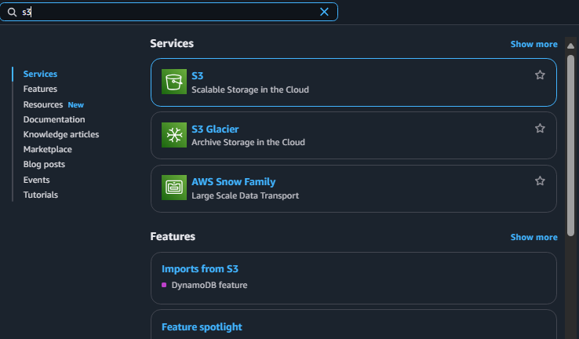
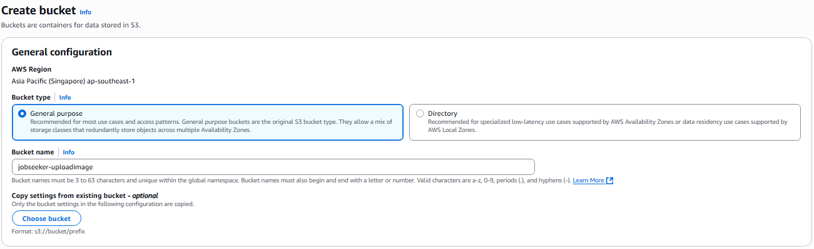
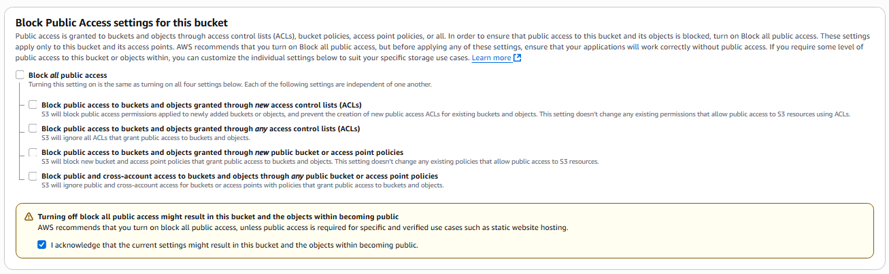
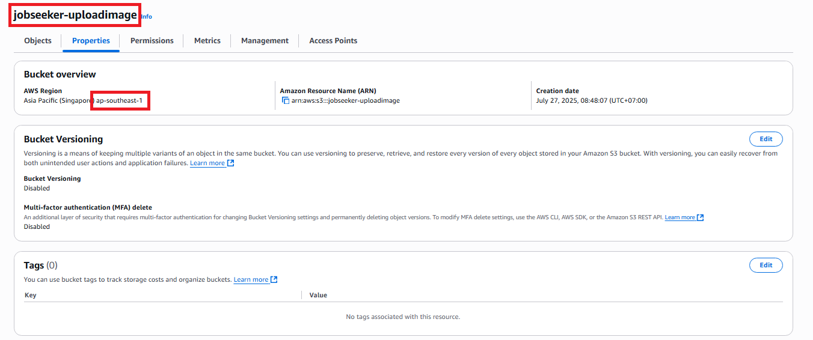
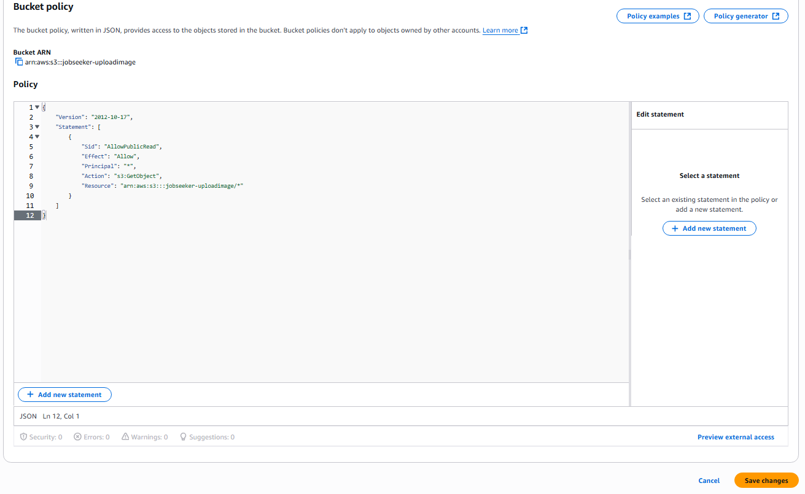

## Create an S3 Bucket

1. Go to the **AWS Management Console** at [https://aws.amazon.com/](https://aws.amazon.com/)

2. Search for and select the **S3** service.



3. In the **General purpose buckets** section, click **Create Bucket**.

4. Enter a bucket name: `jobseeker-uploadimage`



5. In the **Block Public Access settings** section, do the following:

   - **Turn off all block public access options**



6. Keep the remaining settings as default.

7. Click **Create Bucket** to complete.

---

### Result after creating the S3 Bucket:



> ⚠️ **Save the bucket name and region** for use in backend configuration later.

---

## Set Up Bucket Policy

1. Go to the **Permissions** tab of the bucket.

2. Scroll down to **Bucket policy** and click **Edit**.


3. Paste the following JSON into the policy section:

```
{
    "Version": "2012-10-17",
    "Statement": [
        {
            "Sid": "AllowPublicRead",
            "Effect": "Allow",
            "Principal": "*",
            "Action": "s3:GetObject",
            "Resource": "arn:aws:s3:::jobseeker-uploadimage/*"
        }
    ]
}
```



- This is an AWS S3 bucket policy that allows everyone to download (read) files in the bucket jobseeker-uploadimage.

> ⚠️ If you use a different bucket name, replace `jobseeker-uploadimage` in the `"Resource"` section with your bucket name.

4. Click **Save** to save the policy.

---

✅ You have completed setting up an **S3 Bucket** to serve image storage and retrieval.
