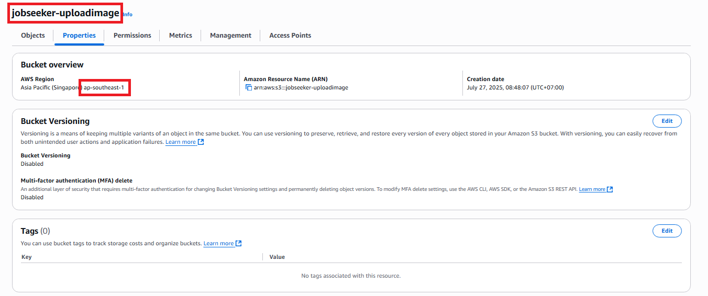
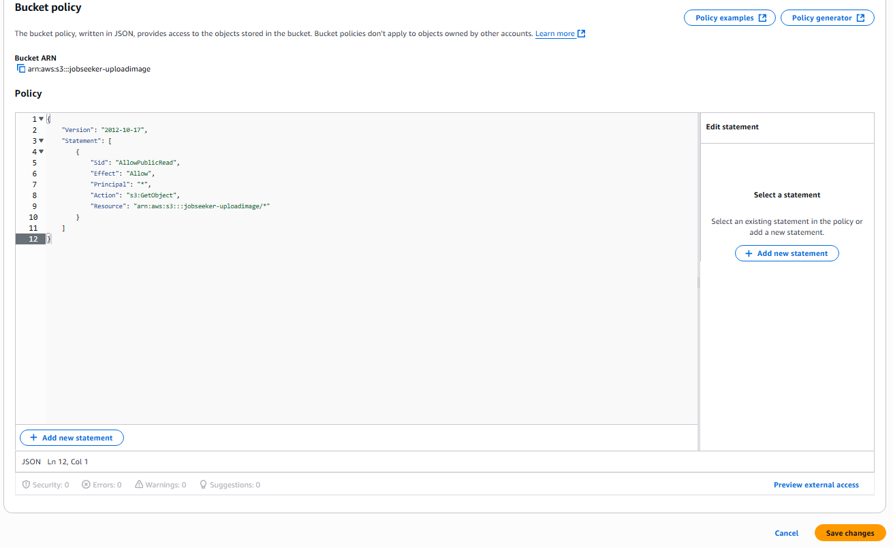

## Tạo S3 Bucket

1. Truy cập **AWS Management Console** tại [https://aws.amazon.com/](https://aws.amazon.com/)

2. Tìm kiếm và chọn dịch vụ **S3**.


3. Trong mục **General purpose buckets**, chọn **Create Bucket**.

4. Đặt tên bucket: `jobseeker-uploadimage`


5. Trong phần **Block Public Access settings**, thực hiện:

   - **Tắt toàn bộ các tùy chọn chặn truy cập công khai (Block Public Access)**


6. Giữ nguyên các thiết lập còn lại mặc định.

7. Nhấn **Create Bucket** để hoàn tất.

---

### Kết quả sau khi tạo S3 Bucket:



> ⚠️ **Lưu lại tên bucket và khu vực (region)** để sử dụng cho phần cấu hình backend.

---

## Thiết lập Bucket Policy

1. Chuyển sang tab **Permissions** của bucket.

2. Cuộn xuống phần **Bucket policy** và nhấn **Edit**.


3. Dán đoạn JSON sau vào phần policy:

```
{
    "Version": "2012-10-17",
    "Statement": [
        {
            "Sid": "AllowPublicRead",
            "Effect": "Allow",
            "Principal": "*",
            "Action": "s3:GetObject",
            "Resource": "arn:aws:s3:::jobseeker-uploadimage/*"
        }
    ]
}
```

- Đây là một bucket policy của AWS S3 cho phép tất cả có thể tải về (read) các file trong bucket jobseeker-uploadimage.



> ⚠️ Nếu bạn sử dụng tên bucket khác, hãy thay thế `jobseeker-uploadimage` trong phần `"Resource"` bằng tên bucket của bạn.

1. Nhấn **Save** để lưu lại policy.

---

✅ Như vậy, bạn đã hoàn tất việc thiết lập một **S3 Bucket** để phục vụ lưu trữ và truy xuất hình ảnh.
