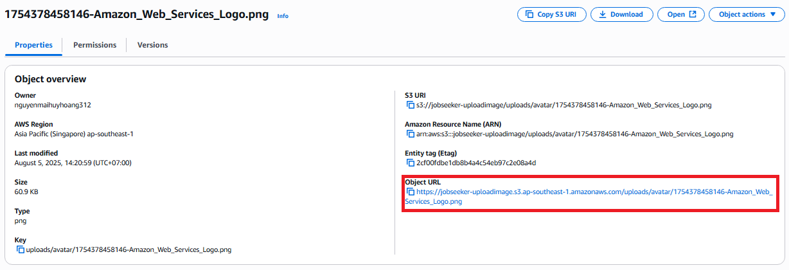
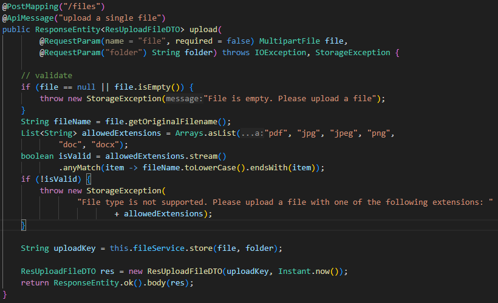

<div style="border-left: 5px solid #1E90FF; background-color: #e6f2ff; padding: 1em; margin: 1em 0;">
<strong>📝 Note:</strong><br>
In this section, we will only review the code to understand how to store files on Amazon S3. No modifications are needed.
</div>

## Review S3 code in backend

- Open the `jobseeker_backend` project
- We will examine 2 main files:
  - `controller/FileController.java` - handles file upload API
  - `service/FileService.java` - S3 storage logic

### 1. Analyze FileController.java

Access the `controller/FileController.java` file to view the API endpoint that handles file uploads:

```java
@PostMapping("/files")
@ApiMessage("upload a single file")
public ResponseEntity<ResUploadFileDTO> upload(
        @RequestParam(name = "file", required = false) MultipartFile file,
        @RequestParam("folder") String folder) throws IOException, StorageException {

    // validate
    if (file == null || file.isEmpty()) {
        throw new StorageException("File is empty. Please upload a file");
    }

    String fileName = file.getOriginalFilename();
    List<String> allowedExtensions = Arrays.asList("pdf", "jpg", "jpeg", "png", "doc", "docx");
    boolean isValid = allowedExtensions.stream()
            .anyMatch(item -> fileName.toLowerCase().endsWith(item));

    if (!isValid) {
        throw new StorageException(
                "File type is not supported. Please upload a file with one of the following extensions: "
                        + allowedExtensions);
    }

    String uploadKey = this.fileService.store(file, folder);

    ResUploadFileDTO res = new ResUploadFileDTO(uploadKey, Instant.now());
    return ResponseEntity.ok().body(res);
}
```

#### API Processing Flow:

1. **Receive data**: Get file from request and destination folder name
2. **Validation**:
   - Check if file exists and is not empty
   - Check file format (only allows: pdf, jpg, jpeg, png, doc, docx)
3. **Storage**: Call **fileService.store()** to upload file to S3
4. **Response**: Return information about successfully uploaded file

### 2. Analyze FileService.java

Access the `service/FileService.java` file to view the business logic for interacting with Amazon S3 to store files.

#### 2.1. S3 Configuration

```java
@Value("${aws.s3.bucket}")
private String bucket;

@Value("${aws.s3.region}")
private String region;

@Value("${aws.s3.base-folder}")
private String baseFolder;
```

**Parameter explanations:**

- `bucket`: S3 bucket name where files are stored
- `region`: AWS region (example: "ap-southeast-1")
- `baseFolder`: Root folder in bucket for organizing files

#### 2.2. store() Method

```java
public String store(MultipartFile file, String folder) throws IOException {
    String fileName = System.currentTimeMillis() + "-" + file.getOriginalFilename();
    String key = (baseFolder != null ? baseFolder : "") +
                 (folder != null ? folder + "/" : "") + fileName;

    PutObjectRequest putOb = PutObjectRequest.builder()
            .bucket(bucket)
            .key(key)
            .contentType(file.getContentType())
            .build();

    getS3Client().putObject(putOb,
            software.amazon.awssdk.core.sync.RequestBody.fromBytes(file.getBytes()));

    return key;
}
```

#### Storage Process:

1. Receive file and folder name to store.
2. Create unique filename by adding timestamp before original name.
3. Create **key** representing the full path in bucket.
4. Create **PutObjectRequest** to configure necessary information for upload.
5. Use S3Client to upload file through **putObject(...)**.
6. Return key for later use.

### Result

After the upload process is completed, the file will be securely stored on Amazon S3. The system will return an **Object endpoint**, which serves as the identifier to access the uploaded file.

#### In S3 console:



#### Accessing images through **Object endpoint**:


