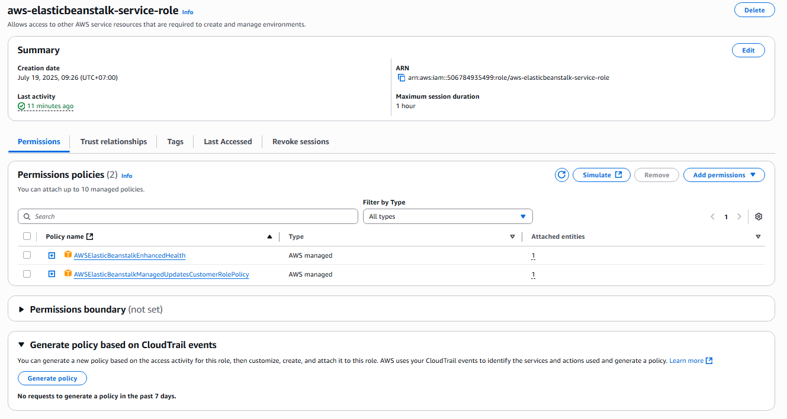

## Create IAM Roles for AWS Elastic Beanstalk

1. Access **AWS Management Console** at [https://aws.amazon.com/](https://aws.amazon.com/)

2. Search for and select **Identity and Access Management (IAM)** service.

3. Switch to the **Roles** tab and click **Create role** to begin.

---

### A. Create Role for EC2 Instance within Beanstalk Environment

#### **Step 1: Select Trusted Entity**

- **Trusted entity type**: `AWS Service`
- **Service or use case**: `EC2`
- **Use case**: `EC2`

#### **Step 2: Add Permissions**

Search for and add the following policies:

- `AmazonS3FullAccess`
  > Allows EC2 to access S3 for storing and retrieving images.
- `AWSElasticBeanstalkCustomPlatformforEC2Role`
  > Grants permissions for EC2 to build and run custom platforms in Elastic Beanstalk.

#### **Step 3: Name and Complete**

- **Role name**: `aws-elasticbeanstalk-ec2-role`
- Review the added policies before clicking **Create role**.

#### ✅ Result after successfully creating the role:

---

### B. Create Role for Elastic Beanstalk Service

Repeat the same steps as in section A, but with the following configuration:

#### **Trusted Entity**

- **Service or use case**: `Elastic Beanstalk`
- **Use case**: `Elastic Beanstalk - Environment`

#### **Add the following policies:**

- `AWSElasticBeanstalkEnhancedHealth`
- `AWSElasticBeanstalkManagedUpdatesCustomerRolePolicy`

> These policies allow Beanstalk to manage environment health and updates more effectively.

#### **Role name**: `aws-elasticbeanstalk-service-role`

#### ✅ Result after creation:

