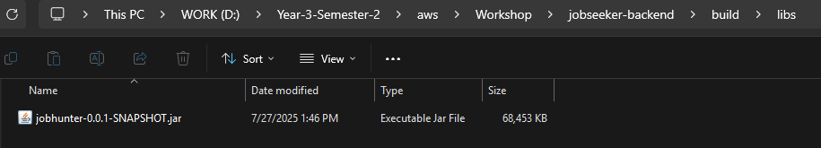

## Clone springboot app về

1. clone github respository này về với đường dẫn sau:

   ```
   git clone https://github.com/MrHH-k22/jobseeker-backend.git
   ```

2. Điều hướng đến thư mục của respository này

   ```
   cd jobseeker-backend
   ```

3. Chạy câu lệnh sau để đóng gói một spring boot app thành file jar

- ```
  ./gradlew bootJar
  ```

4. tại thư mục của respository, vào **build/libs/** để lấy ra file jar



-> file jar này chúng ta sẽ dùng để deploy lên AWS Beanstalk
