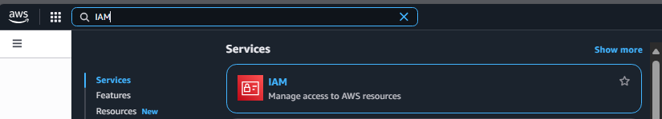
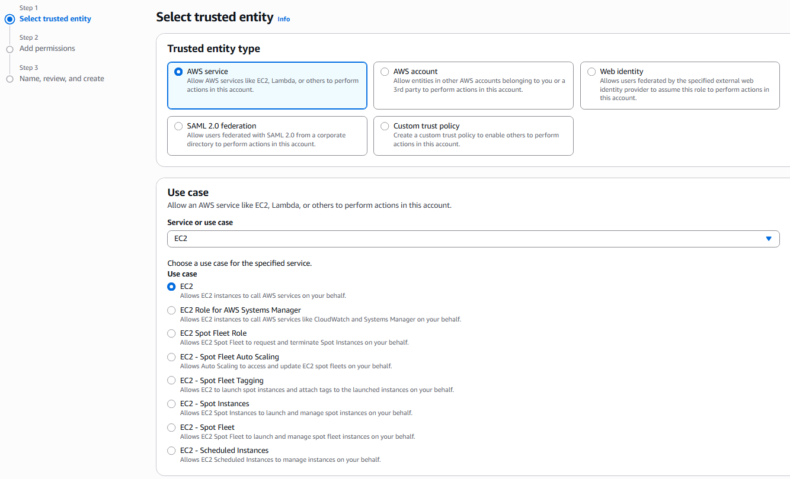
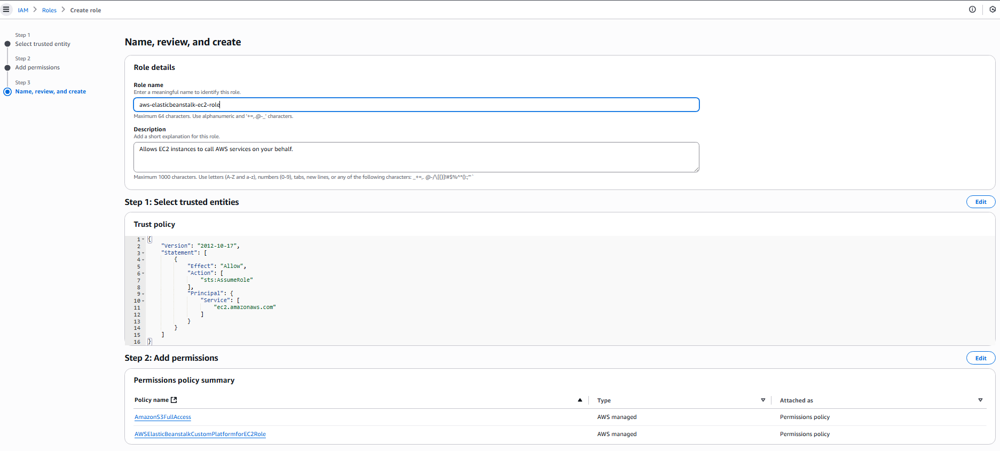
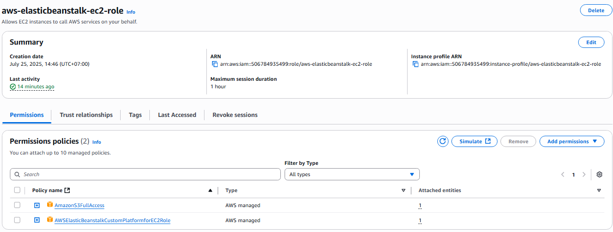
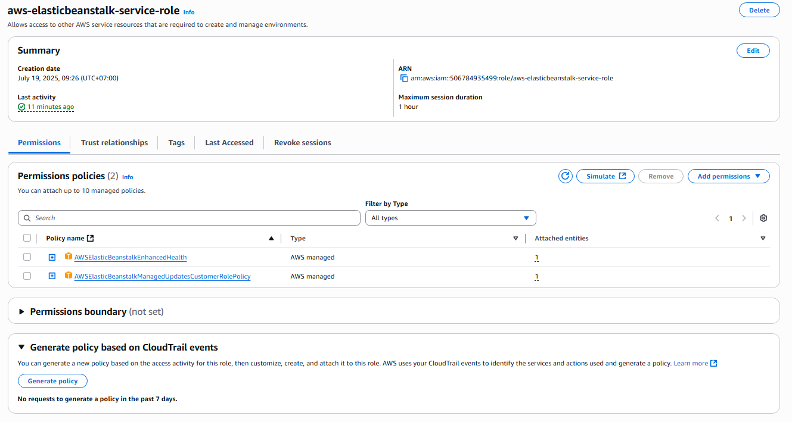

## Tạo các IAM Role cho AWS Elastic Beanstalk

1. Truy cập **AWS Management Console** tại [https://aws.amazon.com/](https://aws.amazon.com/)

2. Tìm kiếm và chọn dịch vụ **Identity and Access Management (IAM)**.

3. Chuyển sang tab **Roles** và nhấn **Create role** để bắt đầu.

---

### A. Tạo Role cho EC2 Instance bên trong môi trường Beanstalk

#### **Bước 1: Chọn Trusted Entity**

- **Trusted entity type**: `AWS Service`
- **Service or use case**: `EC2`
- **Use case**: `EC2`

#### **Bước 2: Thêm quyền (Permissions)**

Tìm kiếm và thêm các chính sách sau:

- `AmazonS3FullAccess`
  > Cho phép EC2 truy cập vào S3 để lưu trữ và truy xuất hình ảnh.
- `AWSElasticBeanstalkCustomPlatformforEC2Role`
  > Cấp quyền để EC2 có thể build và chạy các nền tảng tùy chỉnh trong Elastic Beanstalk.

#### **Bước 3: Đặt tên và hoàn tất**

- **Role name**: `aws-elasticbeanstalk-ec2-role`
- Kiểm tra lại các policy đã thêm trước khi nhấn **Create role**.

#### ✅ Kết quả sau khi tạo role thành công:

---

### B. Tạo Role cho Elastic Beanstalk Service

Thực hiện lại các bước như ở phần A, nhưng với cấu hình sau:

#### **Trusted Entity**

- **Service or use case**: `Elastic Beanstalk`
- **Use case**: `Elastic Beanstalk - Environment`

#### **Thêm các policy sau:**

- `AWSElasticBeanstalkEnhancedHealth`
- `AWSElasticBeanstalkManagedUpdatesCustomerRolePolicy`

> Những policy này cho phép Beanstalk quản lý tình trạng và cập nhật môi trường hiệu quả hơn.

#### **Role name**: `aws-elasticbeanstalk-service-role`

#### ✅ Kết quả sau khi tạo:

