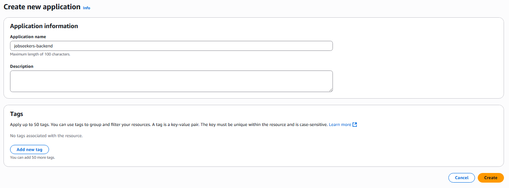
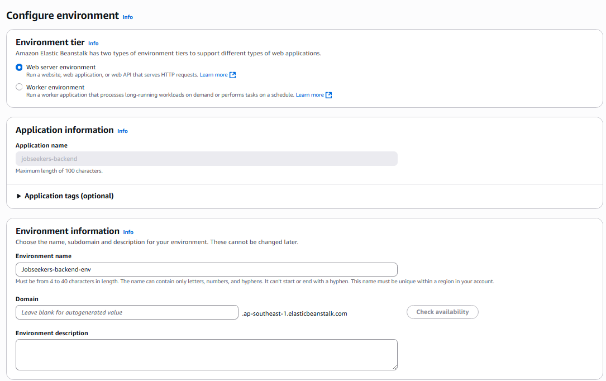
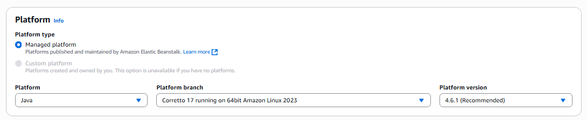
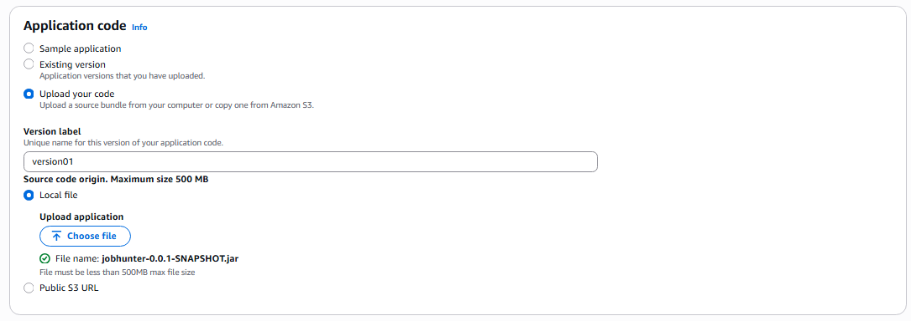
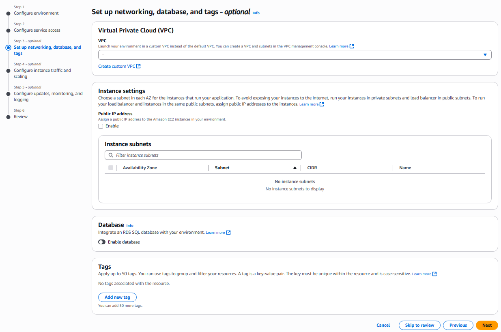
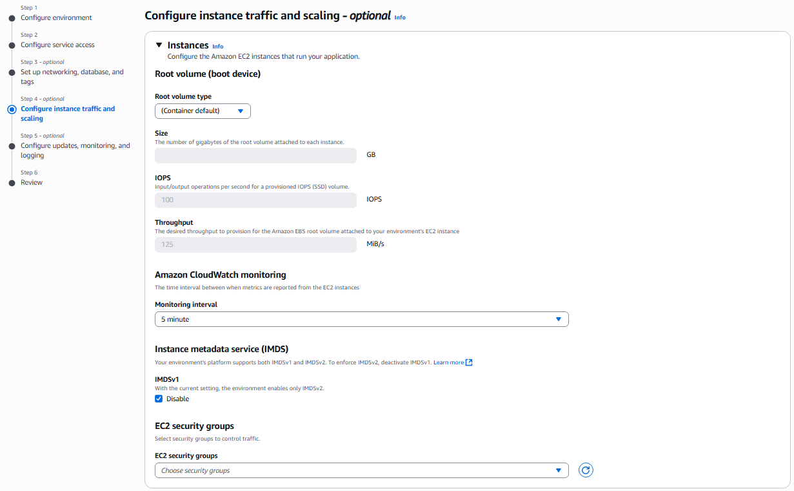
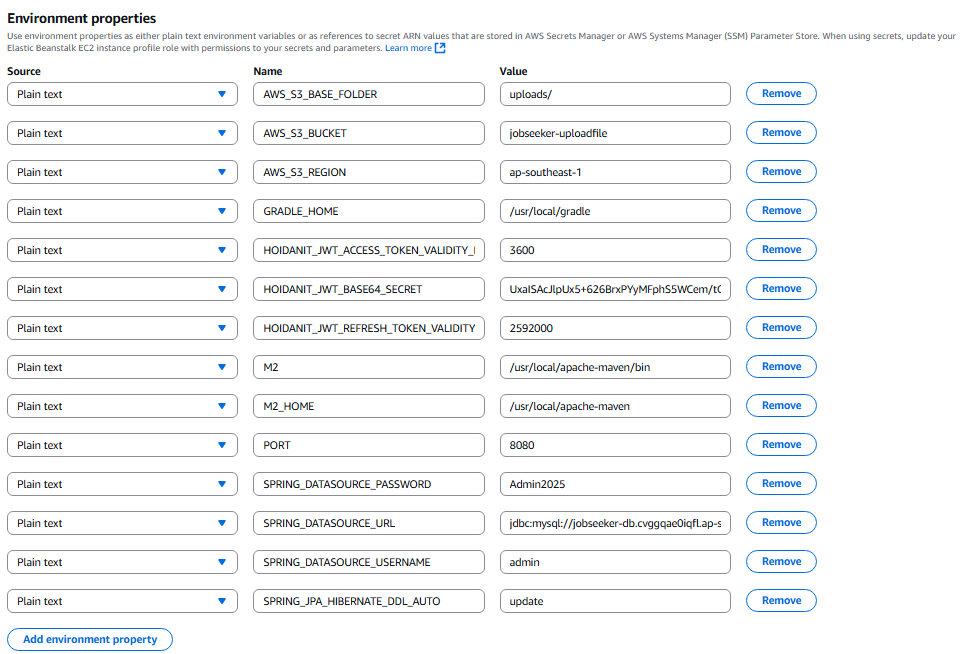
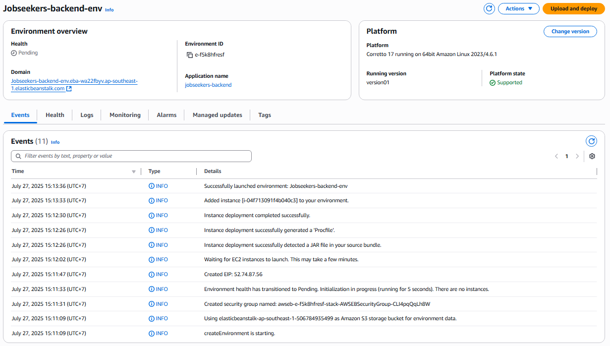

## Create AWS Beanstalk

1. Access **AWS Management Console** at [https://aws.amazon.com/](https://aws.amazon.com/)

2. Search for and select **Elastic Beanstalk** service.

3. In the **Application** tab, click **Create a new application**.

- **Application name**: `jobseekers-backend`

4. After creating the Application, proceed to create a new **Environment**.

---

### **Step 1: Configure Environment**

5. In the **Environment tier & Information** section:

- Select **Web server environment**
- **Environment name**: `Jobseekers-backend-env`
- Keep all other settings as default

6. In the **Platform** section:

- **Platform**: `Java`
- **Platform branch**: `Corretto 17 running on 64 bit Amazon Linux 2023`
- **Platform version**: `4.6.1`

7. In the **Application code** section:

- Select **Upload your code**
- **Version label**: `version01`
- Choose **Local file** and upload the `.jar` file created in the previous step
- Click **Next** to continue

---

### **Step 2: Configure Service Access**

- **Service role**: select the **aws-elasticbeanstalk-service-role** created earlier
- **EC2 instance profile**: select the **aws-elasticbeanstalk-ec2-role** created earlier
- **EC2 key pair**: leave blank

---

### **Step 3: Set Up Networking, Database, and Tags**

- Keep all default configurations and continue to the next step

---

### **Step 4: Configure Instance Traffic and Scaling**

- Keep default configuration
- Elastic Beanstalk will automatically set up EC2 and Security Group, so no manual configuration is needed

---

### **Step 5: Configure Updates, Monitoring, and Logging**

- Scroll to the bottom of the page and add the necessary environment variables for the backend
- Remove unused environment variables and configure new environment variables as follows:

| **Key**                                        | **Value**                                                                                  |
| ---------------------------------------------- | ------------------------------------------------------------------------------------------ |
| AWS_S3_BASE_FOLDER                             | uploads/                                                                                   |
| AWS_S3_BUCKET                                  | Name of the S3 bucket created in the previous step (e.g., `jobseeker-uploadfile`)          |
| AWS_S3_REGION                                  | Region of the S3 bucket, e.g., `ap-southeast-1`                                            |
| GRADLE_HOME                                    | /usr/local/gradle                                                                          |
| HOIDANIT_JWT_ACCESS_TOKEN_VALIDITY_IN_SECONDS  | 3600                                                                                       |
| HOIDANIT_JWT_BASE64_SECRET                     | `UxaISAcJlpUx5+626BrxPYyMFphS5WCem/tODCjONXDyKg9wTaZyzwwhi7k6YLs3eJwn4eYdlrdLAYAyrT5FXQ==` |
| HOIDANIT_JWT_REFRESH_TOKEN_VALIDITY_IN_SECONDS | 2592000                                                                                    |
| M2                                             | /usr/local/apache-maven/bin                                                                |
| M2_HOME                                        | /usr/local/apache-maven                                                                    |
| PORT                                           | 8080                                                                                       |
| SPRING_DATASOURCE_PASSWORD                     | Database access password (set by you when creating the database)                           |
| SPRING_DATASOURCE_URL                          | JDBC URL of the database (e.g., `jdbc:mysql://<host>:<port>/<scheme>`)                     |
| SPRING_DATASOURCE_USERNAME                     | Database username (e.g., `admin`)                                                          |
| SPRING_JPA_HIBERNATE_DDL_AUTO                  | update                                                                                     |

- Click the **`Create`** button to start initializing the AWS Elastic Beanstalk environment.

---

### Result after creating AWS Beanstalk

- After creation is complete, click on the backend URL displayed on the screen.
- If you can access it successfully and receive a message like the one below, it means the backend has been deployed successfully:

