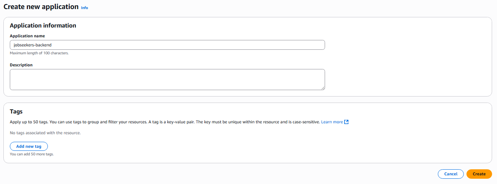
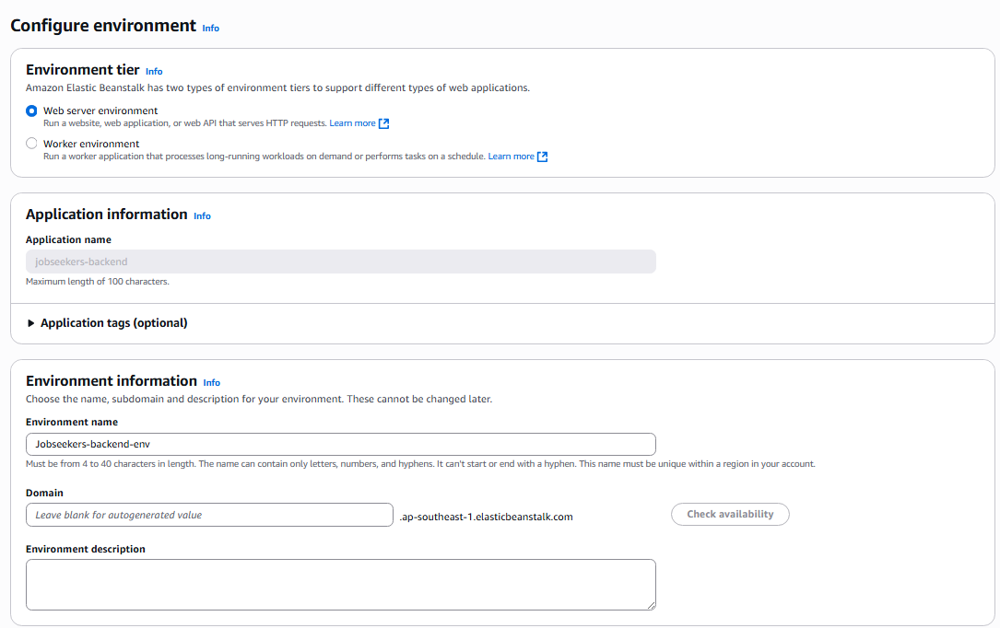
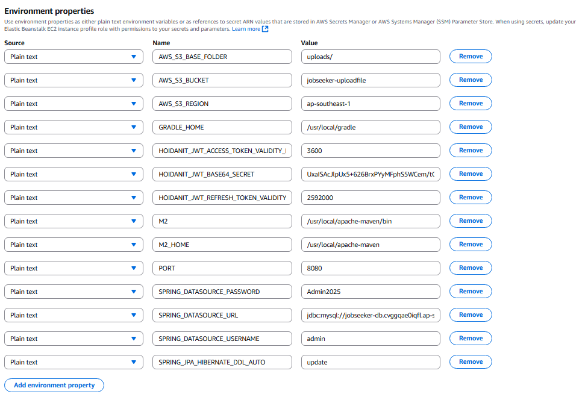

## Tạo AWS Beanstalk

1. Truy cập **AWS Management Console** tại [https://aws.amazon.com/](https://aws.amazon.com/)

2. Tìm kiếm và chọn dịch vụ **Elastic Beanstalk**.

3. Trong tab **Application**, nhấn **Create a new application**.

- **Application name**: `jobseekers-backend`

4. Sau khi tạo Application, tiến hành tạo mới một **Environment**.

---

### **Bước 1: Configure Environment**

5. Ở phần **Environment tier & Information**:

- Chọn **Web server environment**
- **Environment name**: `Jobseekers-backend-env`
- Các mục còn lại giữ nguyên mặc định

6. Ở phần **Platform**:

- **Platform**: `Java`
- **Platform branch**: `Corretto 17 running on 64 bit Amazon Linux 2023`
- **Platform version**: `4.6.1`

7. Ở phần **Application code**:

- Chọn **Upload your code**
- **Version label**: `version01`
- Chọn **Local file** và upload file `.jar` đã tạo từ bước trước
- Nhấn **Next** để tiếp tục

---

### **Bước 2: Configure Service Access**

- **Service role**: chọn role **aws-elasticbeanstalk-service-role** đã tạo trước đó
- **EC2 instance profile**: chọn role **aws-elasticbeanstalk-ec2-rolee** đã tạo trước đó
- **EC2 key pair**: để trống

---

### **Bước 3: Set Up Networking, Database, and Tags**

- Giữ nguyên toàn bộ cấu hình mặc định và tiếp tục sang bước kế tiếp

---

### **Bước 4: Configure Instance Traffic and Scaling**

- Giữ nguyên cấu hình mặc định
- Elastic Beanstalk sẽ tự động thiết lập EC2 và Security Group nên không cần cấu hình thủ công

---

### **Bước 5: Configure Updates, Monitoring, and Logging**

- Cuộn xuống cuối trang và thêm các biến môi trường cần thiết cho backend
- Xóa bỏ các biến môi trường không sử dụng, và cấu hình lại các biến môi trường mới như sau:

| **Key**                                          | **Value**                                                                                  |
| ------------------------------------------------ | ------------------------------------------------------------------------------------------ |
| `AWS_S3_BASE_FOLDER`                             | uploads/                                                                                   |
| `AWS_S3_BUCKET`                                  | Tên của S3 bucket đã tạo ở bước trước (ví dụ: `jobseeker-uploadimage`)                     |
| `AWS_S3_REGION`                                  | Vùng (region) của S3 bucket, ví dụ: `ap-southeast-1`                                       |
| `GRADLE_HOME`                                    | /usr/local/gradle                                                                          |
| `HOIDANIT_JWT_ACCESS_TOKEN_VALIDITY_IN_SECONDS`  | 3600                                                                                       |
| `HOIDANIT_JWT_BASE64_SECRET`                     | `UxaISAcJlpUx5+626BrxPYyMFphS5WCem/tODCjONXDyKg9wTaZyzwwhi7k6YLs3eJwn4eYdlrdLAYAyrT5FXQ==` |
| `HOIDANIT_JWT_REFRESH_TOKEN_VALIDITY_IN_SECONDS` | 2592000                                                                                    |
| `M2`                                             | /usr/local/apache-maven/bin                                                                |
| `M2_HOME`                                        | /usr/local/apache-maven                                                                    |
| `PORT`                                           | 8080                                                                                       |
| `SPRING_DATASOURCE_PASSWORD`                     | Mật khẩu truy cập cơ sở dữ liệu (do bạn thiết lập khi tạo database)                        |
| `SPRING_DATASOURCE_URL`                          | JDBC URL của cơ sở dữ liệu (ví dụ: `jdbc:mysql://<host>:<port>/<scheme>`)                  |
| `SPRING_DATASOURCE_USERNAME`                     | Tên đăng nhập cơ sở dữ liệu (ví dụ: `admin`)                                               |
| `SPRING_JPA_HIBERNATE_DDL_AUTO`                  | update                                                                                     |

- Nhấn nút **`Create`** để bắt đầu khởi tạo môi trường AWS Elastic Beanstalk.

---

### Kết quả sau khi tạo AWS Beanstalk

- Sau khi tạo xong, nhấn vào đường link của backend được hiển thị trên màn hình.
- Nếu truy cập thành công và nhận được thông báo như bên dưới, nghĩa là backend đã được triển khai thành công:

