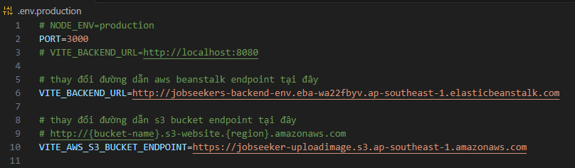
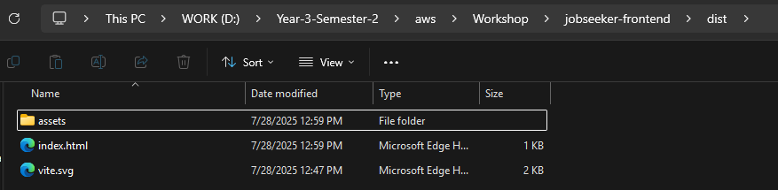

## Clone the React app

1. Clone this GitHub repository using the following URL:

   ```
   git clone https://github.com/MrHH-k22/jobseeker-frontend.git
   ```

2. Navigate to the repository directory

   ```
   cd jobseeker-frontend
   ```

3. Run the following command to install all libraries for the project.

   ```
   npm install
   ```

4. Add environment variables

- Go to the .env.production file to update the URL for AWS Beanstalk and S3 bucket for image processing.



5. Run the following command to compile the app source code into static HTML/CSS/JS code ready for server deployment.

- ```
  npm run build
  ```

6. After a successful build, a folder named dist will be created, containing all the static code of the application.



-> The static files in this folder will be used to deploy to AWS S3.
