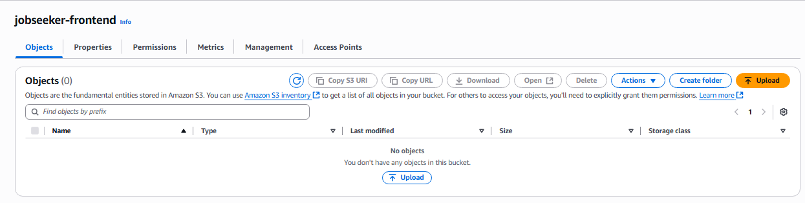
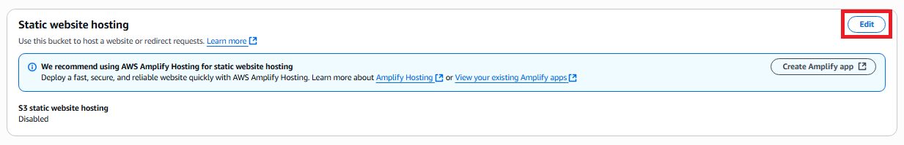
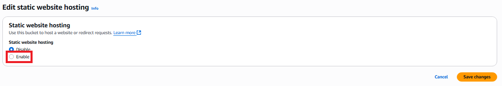
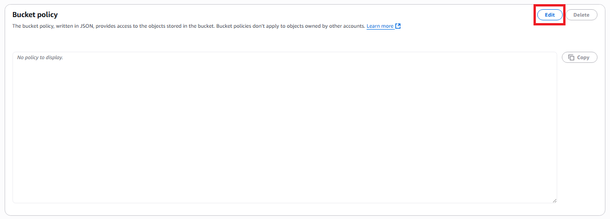
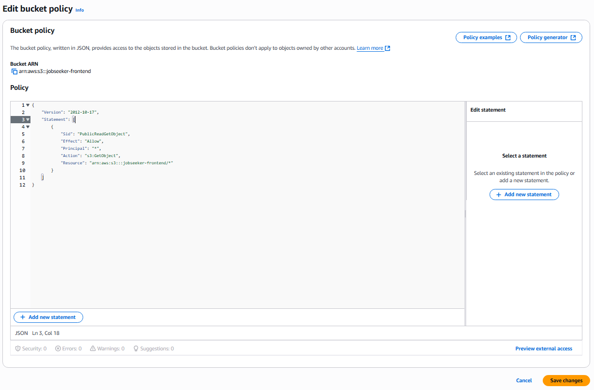

## A. Create S3 Bucket

1. Access **AWS Management Console** at [https://aws.amazon.com/](https://aws.amazon.com/)

2. Search for and select **S3** service.


3. In the **General purpose buckets** section, select **Create Bucket**.

4. Name the bucket: `jobseeker-frontend`


5. In the **Block Public Access settings** section:

   - **Disable all Block Public Access options**


6. Keep all other settings as default.

7. Click **Create Bucket** to complete.

---

### Result after creating S3 Bucket:



## B. Upload static code to S3

- Click the upload button to start uploading files:
- Drag all compiled files from the previous step located in the dist folder and drop them here


- Click upload to start uploading

### Result when upload is successful:


## C. Enable S3 static website hosting feature

- 1. Go to the properties tab
- 2. Scroll down to the **Static website hosting** section
- 3. Click **Edit**



- 4. Enable **Static website hosting**



- 5. Configure the following:

  - Hosting type: **Host a static website**
  - Index document: enter **index.html**
  - Error document: enter **index.html**


- 6. Click **Save changes** to save everything

## D. Set up Bucket Policy

1. Switch to the **Permissions** tab of the bucket.

2. Scroll down to the **Bucket policy** section and click **Edit**.



3. Paste the following JSON into the policy section:

```
{
    "Version": "2012-10-17",
    "Statement": [
        {
            "Sid": "PublicReadGetObject",
            "Effect": "Allow",
            "Principal": "*",
            "Action": "s3:GetObject",
            "Resource": "arn:aws:s3:::jobseeker-frontend/*"
        }
    ]
}
```



> ⚠️ If you use a different bucket name, replace `jobseeker-frontend` in the `"Resource"` section with your bucket name.

4. Click **Save** to save the policy.

---

✅ You have successfully completed deploying the React web app to an **S3 Bucket**.
