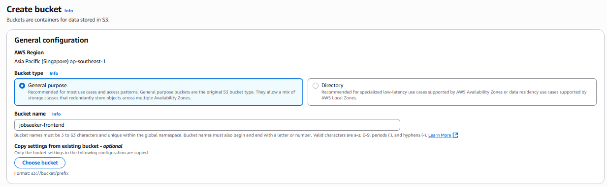
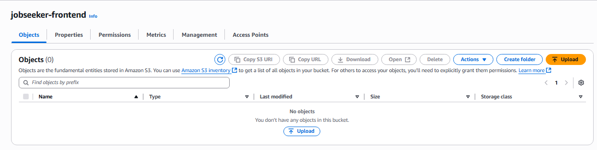
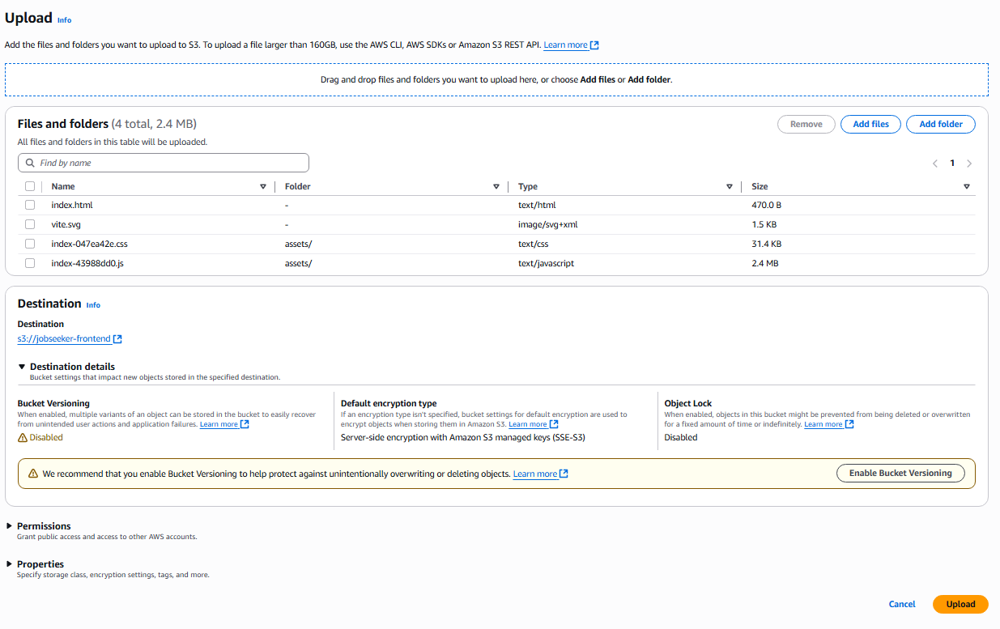
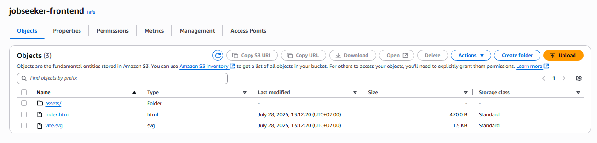
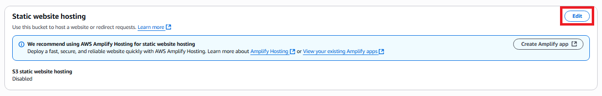
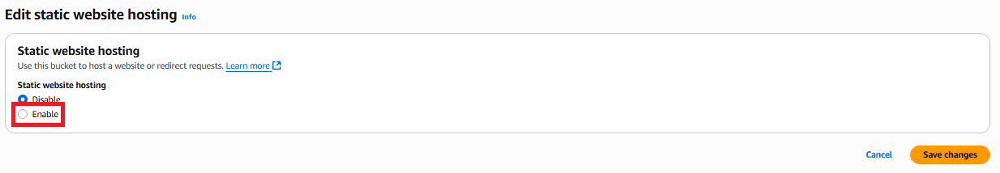
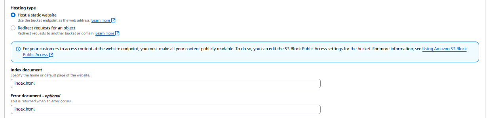
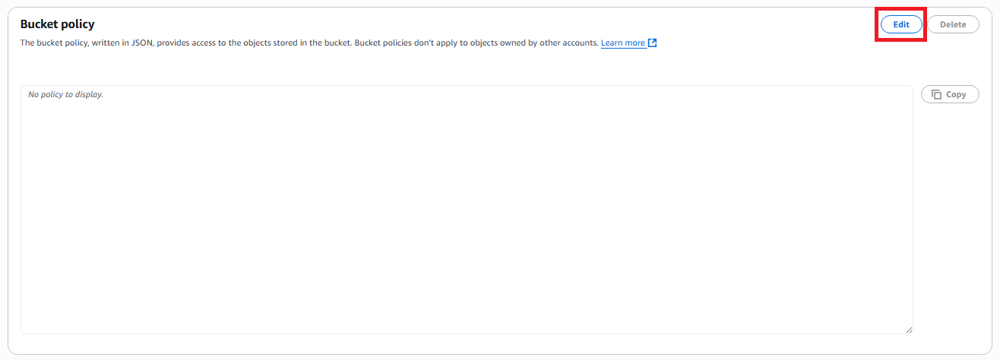
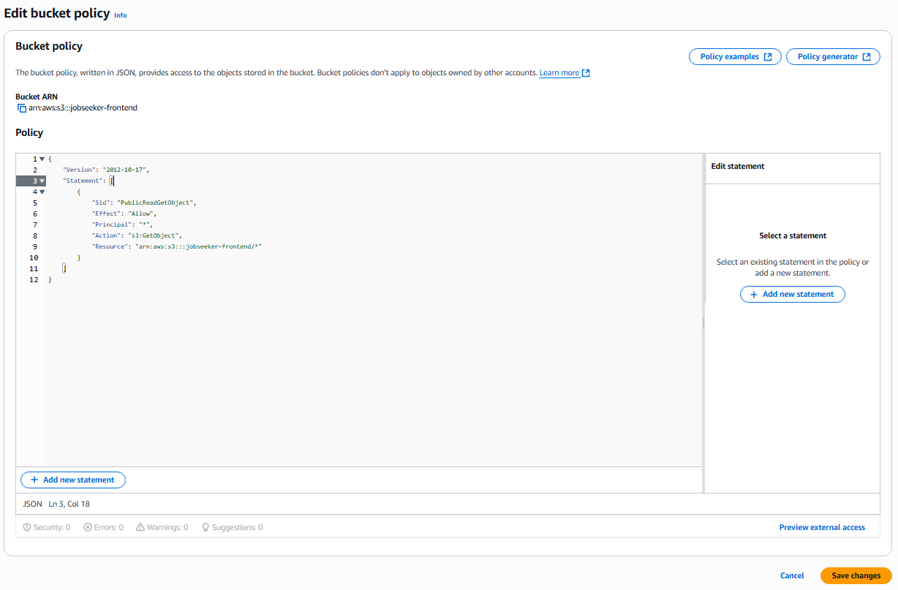

## A. Tạo S3 Bucket

1. Truy cập **AWS Management Console** tại [https://aws.amazon.com/](https://aws.amazon.com/)

2. Tìm kiếm và chọn dịch vụ **S3**.


3. Trong mục **General purpose buckets**, chọn **Create Bucket**.

4. Đặt tên bucket: `jobseeker-frontend`



5. Trong phần **Block Public Access settings**, thực hiện:

   - **Tắt toàn bộ các tùy chọn chặn truy cập công khai (Block Public Access)**


6. Giữ nguyên các thiết lập còn lại mặc định.

7. Nhấn **Create Bucket** để hoàn tất.

---

### Kết quả sau khi tạo S3 Bucket:



## B. Tải các mã tĩnh lên s3

- bấm nút upload để bắt đầu tải các file:
- kéo toàn bộ các file đã biên dịch trong bước trước nằm trong thư mục dist và thả vào



- bấm upload để bắt đầu tải

### Kết quả khi tải thành công:



## C. Bật tính năng lưu trữ website tĩnh của S3

- 1. vào tab properties
- 2. Cuộn xuống đến phần **Static website hosting**
- 3. Nhấn **Edit**



- 4. Bật tính năng cho phép **Static website hosting**



- 5. Chỉnh các mục sau:

  - Hosting type:**Host a static website**
  - Index document: nhập **index.html**
  - Error document: nhập **index.html**



- 6. Nhấn **Save changes** để lưu lại toàn bộ

## D. Thiết lập Bucket Policy

1. Chuyển sang tab **Permissions** của bucket.

2. Cuộn xuống phần **Bucket policy** và nhấn **Edit**.



3. Dán đoạn JSON sau vào phần policy:

```
{
    "Version": "2012-10-17",
    "Statement": [
        {
            "Sid": "PublicReadGetObject",
            "Effect": "Allow",
            "Principal": "*",
            "Action": "s3:GetObject",
            "Resource": "arn:aws:s3:::jobseeker-frontend/*"
        }
    ]
}
```



> ⚠️ Nếu bạn sử dụng tên bucket khác, hãy thay thế `jobseeker-frontend` trong phần `"Resource"` bằng tên bucket của bạn.

1. Nhấn **Save** để lưu lại policy.

---

✅ Như vậy, bạn đã hoàn tất việc Triển khai react web app lên một **S3 Bucket**.
