## A. Create AWS CloudFront

1. Access **AWS Management Console** at [https://aws.amazon.com/](https://aws.amazon.com/).

2. Search for and select **CloudFront** service.

   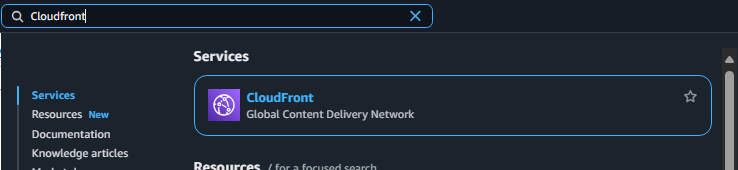

3. In the **Distributions** section, click **Create Distribution**.

---

### Step 1: Initialize Distribution

- Enter Distribution name: **jobseeker-frontend**

  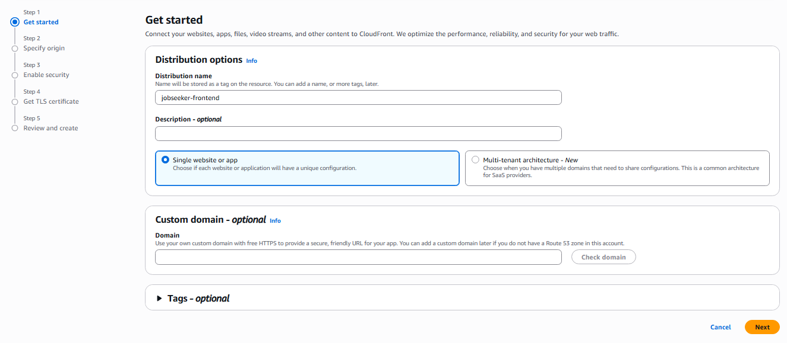

---

### Step 2: Configure Origin

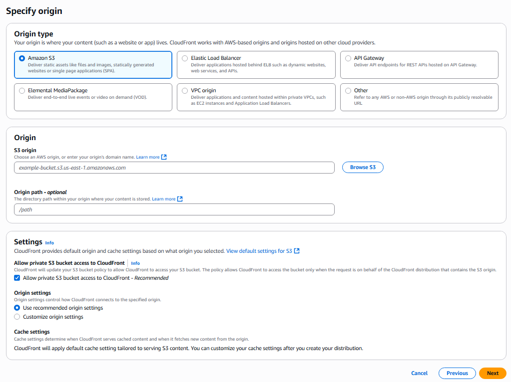

- Select **Origin type**: `Amazon S3`
- In the **S3 origin** section, select **Browse S3**.

  - Check **Allow private S3 bucket access to CloudFront**
  - Select the S3 bucket created earlier

  

- After selection, AWS may suggest using **website endpoint** since the bucket has static web hosting enabled.

  ➤ Click **Use website endpoint** to update the endpoint:

  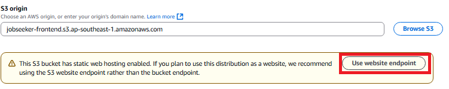

- Result of S3 endpoint after selection:

  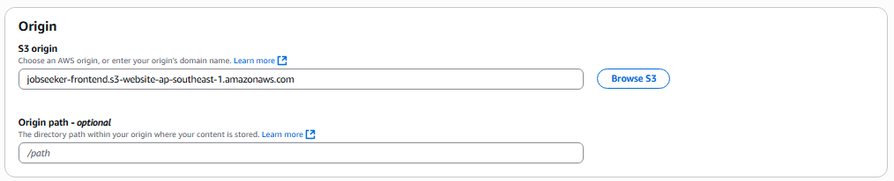

> 📌 **Note:** If AWS doesn't show the suggestion, you can manually enter the endpoint following this structure:

```bash
http://{bucket-name}.s3-website.{region}.amazonaws.com
```

---

### Step 5: Set up Security (Enable Security)

- Select: **Do not enable security protections**

  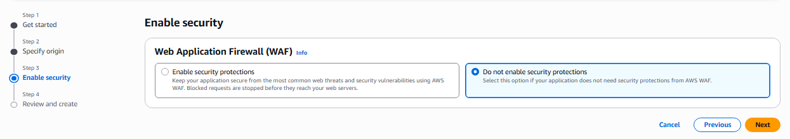

- Then, review all configurations and click **Create distribution** to complete the creation process.

---

## D. Result after deploying CloudFront

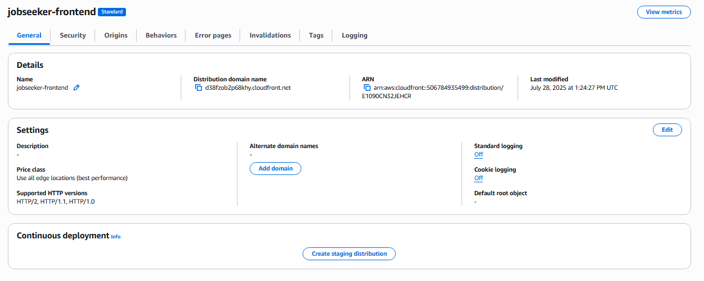

---

## E. Reconfigure Behaviour for CloudFront

1. Switch to the **Behaviours** tab
2. Select a behaviour and click **Edit**

   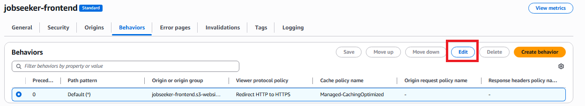

3. Edit the following settings:

   - **Viewer protocol policy**: `HTTP and HTTPS`
   - **Allowed HTTP methods**: `GET, HEAD, OPTIONS, PUT, POST, PATCH, DELETE`

   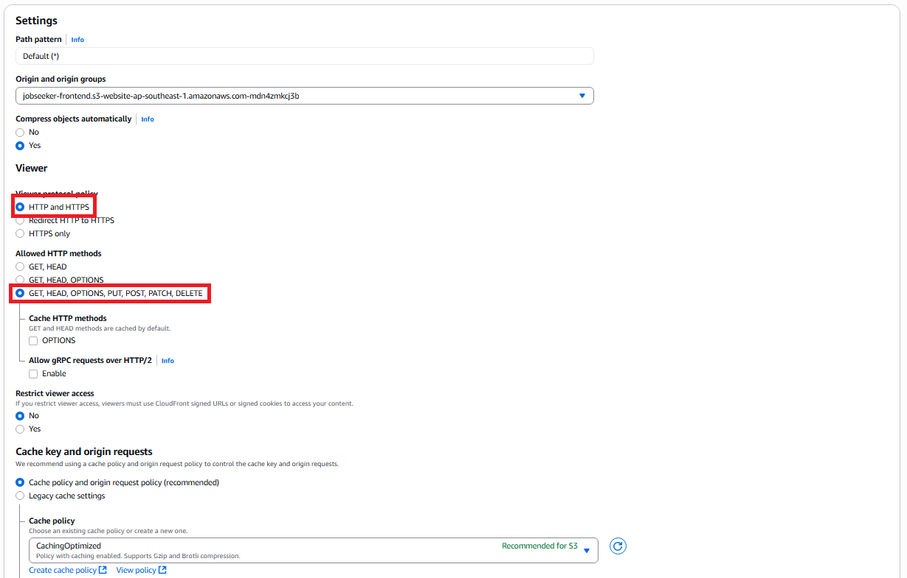

4. Keep other settings unchanged → click **Save Changes** to save the configuration.

---

## F. Test CloudFront Endpoint

- Copy the **Distribution domain name** and paste it into a browser to check the result.

  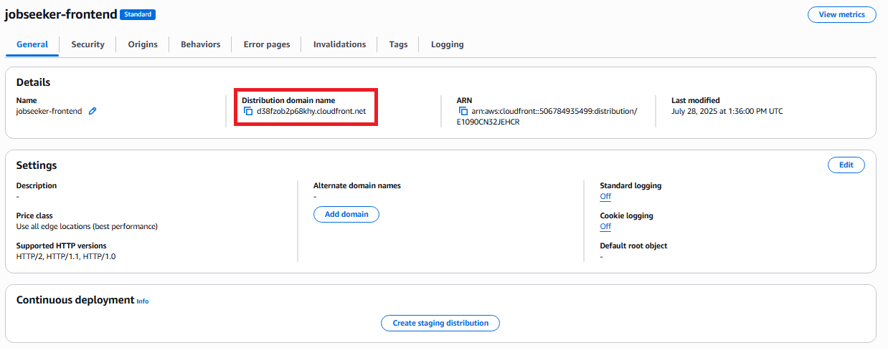

- Website interface after successful distribution:

  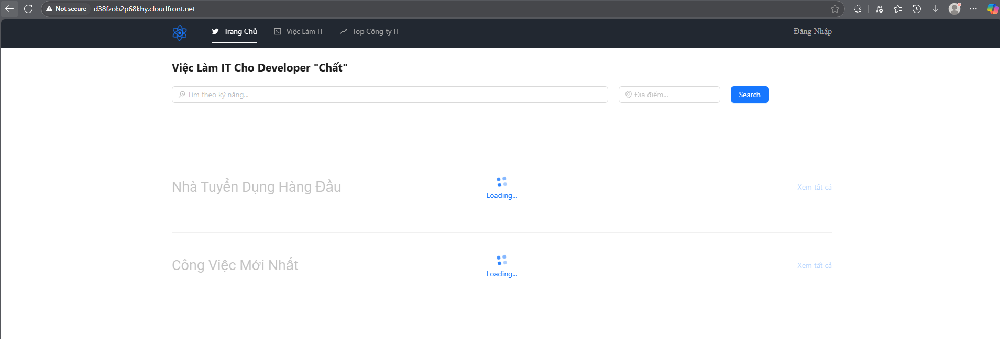

---

✅ You have successfully completed distributing static web content through **Amazon CloudFront** efficiently.
