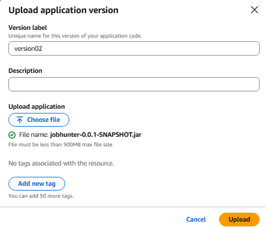

## A. The Problem

- When opening Developer Console in the browser, we see a CORS error like this:

  

- **Explanation:**  
  CORS error occurs when the frontend (CloudFront) sends requests to the backend (Elastic Beanstalk) on a different domain, but the backend doesn't allow that domain to access it. Specifically, the backend hasn't returned the `Access-Control-Allow-Origin` header, causing the browser to block the request for security reasons.

---

## B. Solution

### 1. Reconfigure CORS in the backend

1. Open the `jobseeker_backend` project.
2. Access the `config/CorsConfig.java` file.
3. Update the frontend endpoint by:

   - Copying the CloudFront endpoint
   - Adding it to the `setAllowedOrigins` method

   

### Configuration explanations:

- `setAllowedOrigins`: Specifies which domains are allowed to send requests to the backend.
- `setAllowedMethods`: Allows HTTP methods like `GET`, `POST`, etc.
- `setAllowedHeaders`: Specifies which headers the client can send.
- `setAllowCredentials`: Allows sending cookies or authentication tokens like JWT.
- `setMaxAge`: Sets the cache time for preflight requests.
- `registerCorsConfiguration("/**")`: Applies CORS to all endpoints.

4. Save the file after editing.

---

### 2. Rebuild the `.jar` file and redeploy the backend

5. Perform the steps to rebuild the `.jar` file similar to section **4.2** previously.
6. Access **AWS Management Console**, select **Elastic Beanstalk** service.
7. Go to the backend application.
8. Select the **Application versions** tab.

   

9. Click **Upload**, select the newly built `.jar` file.
10. Name the version: `version02` and upload.

11. After successful upload, select the newly created version → click **Actions** → select **Deploy**.

12. Select the corresponding environment and click **Deploy** to deploy.

---

✅ You have successfully completed fixing the **CORS** error, ensuring that the frontend and backend can connect to each other safely and correctly.
