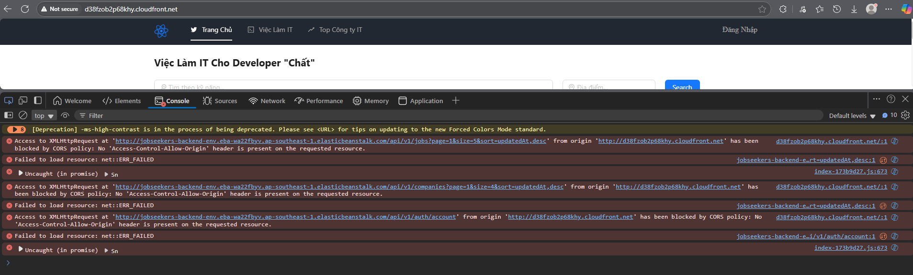
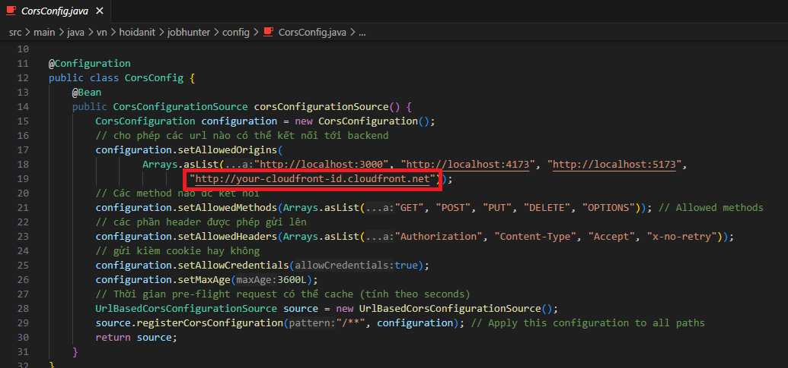
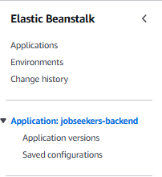
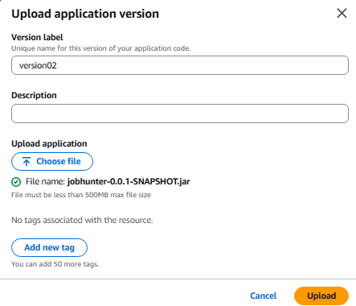
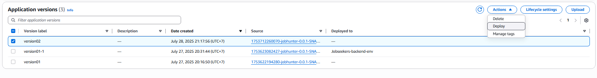
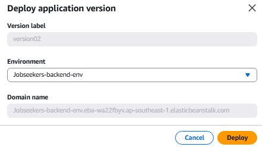

## A. Vấn đề

- Khi mở Developer Console trên trình duyệt, ta thấy lỗi CORS như sau:

  

- **Giải thích:**  
  Lỗi CORS xảy ra khi frontend (CloudFront) gửi request đến backend (Elastic Beanstalk) khác domain, nhưng backend không cho phép domain đó truy cập. Cụ thể, backend chưa trả về header `Access-Control-Allow-Origin`, dẫn đến trình duyệt chặn request vì lý do bảo mật.

---

## B. Giải pháp

### 1. Cấu hình lại CORS trong backend

1. Mở project `jobseeker_backend`.
2. Truy cập file `config/CorsConfig.java`.
3. Cập nhật lại endpoint frontend bằng cách:

   - Sao chép endpoint CloudFront
   - Thêm vào phương thức `setAllowedOrigins`

   

### Giải thích các cấu hình:

- `setAllowedOrigins`: Chỉ định các domain được phép gửi request đến backend.
- `setAllowedMethods`: Cho phép các HTTP method như `GET`, `POST`, v.v.
- `setAllowedHeaders`: Chỉ định các header mà client có thể gửi.
- `setAllowCredentials`: Cho phép gửi kèm cookie hoặc token xác thực như JWT.
- `setMaxAge`: Thiết lập thời gian cache cho preflight request.
- `registerCorsConfiguration("/**")`: Áp dụng CORS cho tất cả các endpoint.

4. Lưu lại file sau khi chỉnh sửa.

---

### 2. Build lại file `.jar` và triển khai lại backend

5. Thực hiện các bước build lại file `.jar` tương tự như mục **4.2** trước đó.
6. Truy cập **AWS Management Console**, chọn dịch vụ **Elastic Beanstalk**.
7. Vào ứng dụng backend.
8. Chọn tab **Application versions**.

   

9. Nhấn **Upload**, chọn file `.jar` vừa build.
10. Đặt tên phiên bản: `version02` và upload.

11. Sau khi upload thành công, chọn phiên bản vừa tạo → nhấn **Actions** → chọn **Deploy**.

12. Chọn môi trường tương ứng và nhấn **Deploy** để triển khai.

---

✅ Như vậy, bạn đã hoàn tất việc sửa lỗi **CORS**, đảm bảo frontend và backend có thể kết nối với nhau an toàn và đúng cách.
