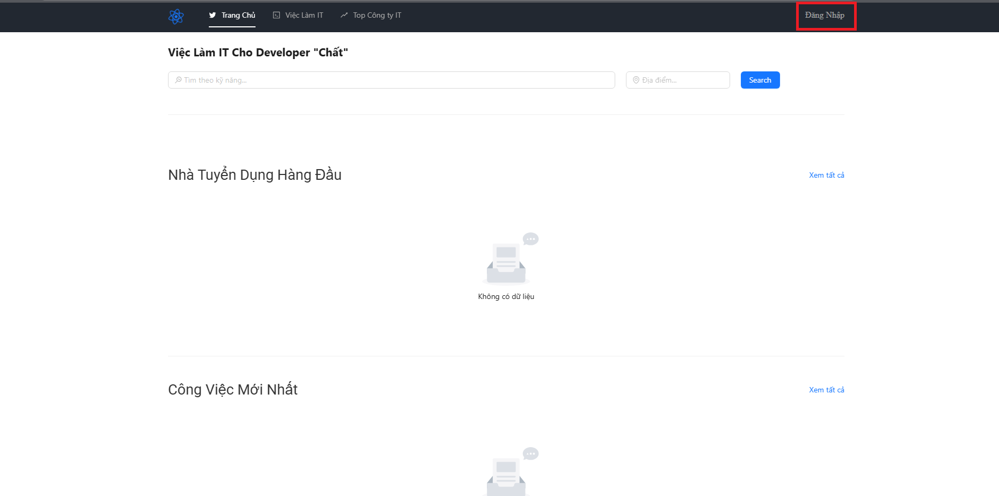
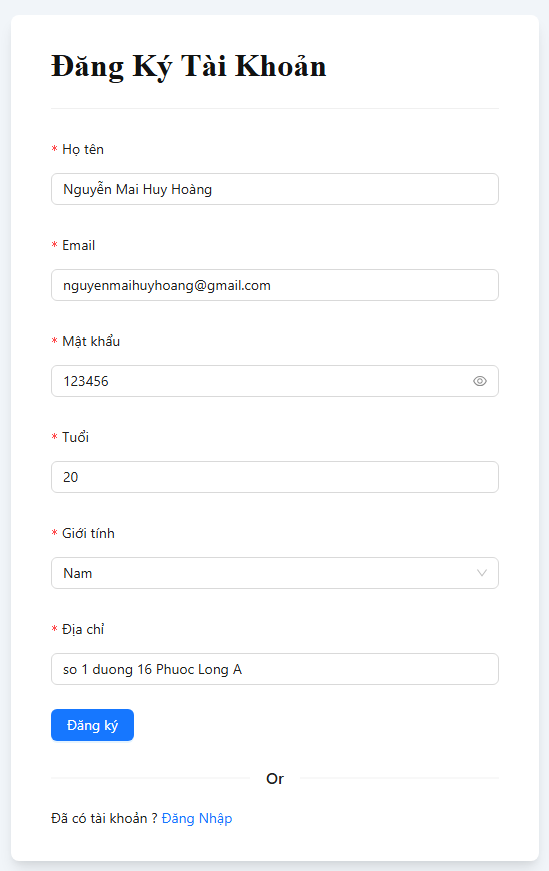
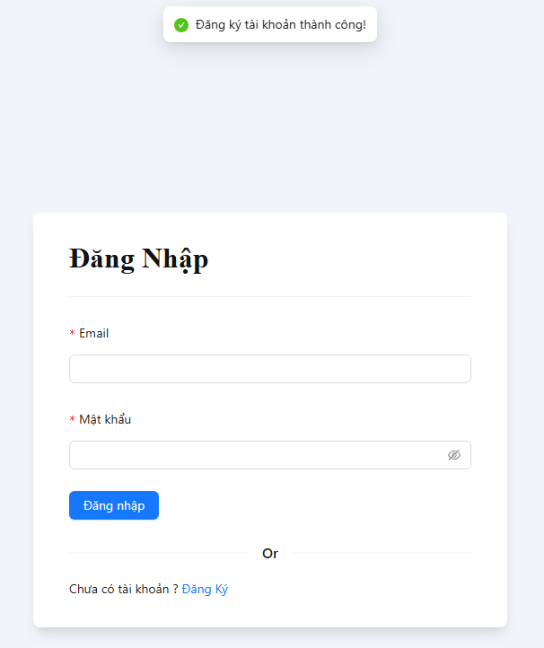
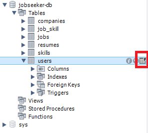
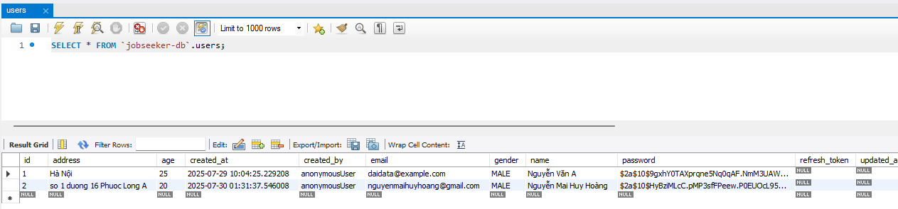
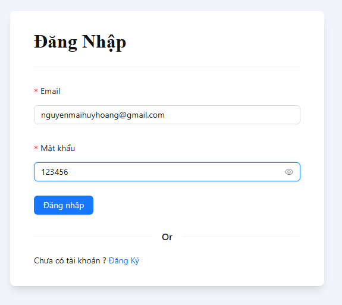
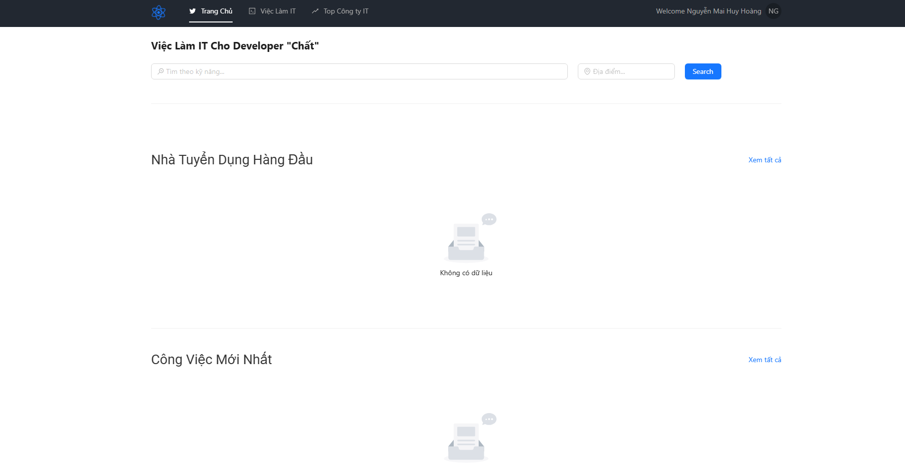

## A. Registration Feature

1. Visit the website and click the **Login** button.

   

2. In the login dialog, click the **Register** button.

   

3. Fill in the user information and click **Submit** to submit the form.

4. If successful, the system will display the message: **"Account registration successful"**.

   

### Check in the Database

1. Open MySQL Workbench and access your database.

2. Select the **User** table.

   

3. The newly registered user data will be displayed in the table.

   

---

## B. Login Feature

1. Use the registered account to log in to the system.

   

2. After a successful login, the system will redirect to the main page or user interface.

   

---

✅ With that, we’ve completed testing the **Registration** and **Login** features.
