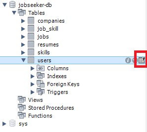
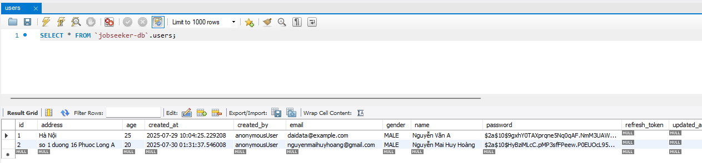

## A. Tính năng Đăng ký

1. Truy cập vào trang web và bấm vào nút **Đăng nhập**.

   

2. Trong hộp thoại đăng nhập, bấm vào nút **Đăng ký**.

   

3. Nhập đầy đủ thông tin người dùng và nhấn **Submit** để gửi biểu mẫu.

4. Nếu thành công, hệ thống sẽ hiển thị thông báo: **"Đăng ký tài khoản thành công"**.

   

### Kiểm tra trong cơ sở dữ liệu

1. Mở MySQL Workbench và truy cập vào cơ sở dữ liệu của bạn.

2. Chọn bảng **User**.

   

3. Dữ liệu người dùng vừa đăng ký sẽ hiển thị trong bảng.

   

---

## B. Tính năng Đăng Nhập

1. Sử dụng tài khoản đã đăng ký để đăng nhập vào hệ thống.

   

2. Sau khi đăng nhập thành công, hệ thống sẽ chuyển sang trang chính hoặc giao diện người dùng.

   

---

✅ Như vậy, chúng ta đã hoàn tất việc kiểm tra chức năng **Đăng ký** và **Đăng nhập**.
