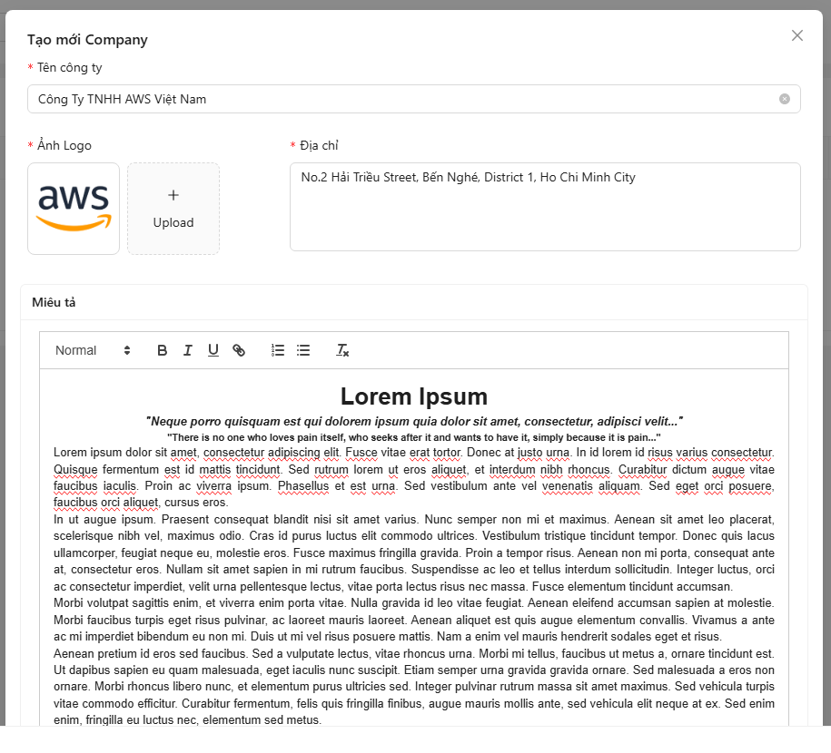
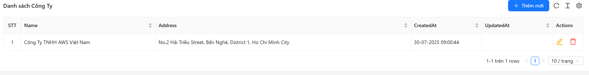
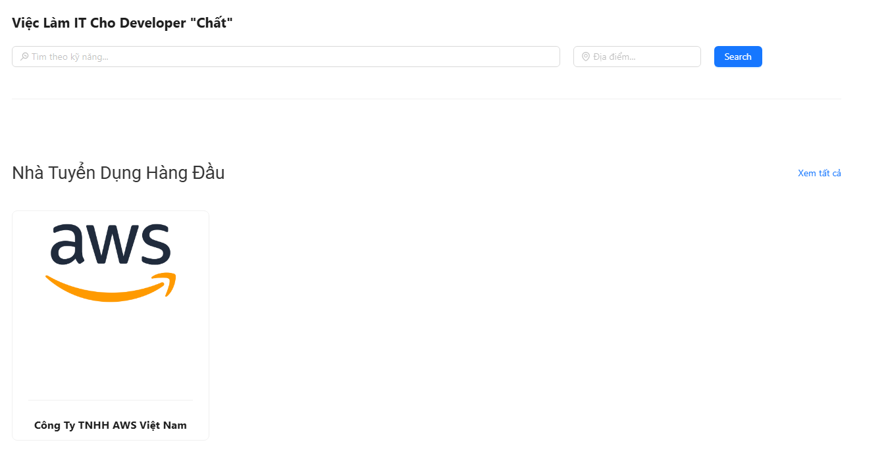
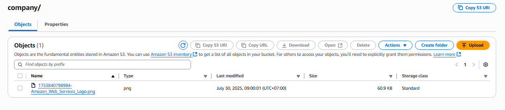
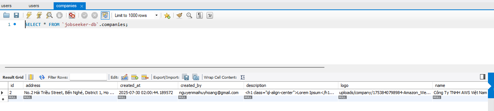

## Create a New Company

1. Go to the **Dashboard** and select the **Company** tab.
2. Click the **Add New** button.
3. Fill in the company details and choose an image, then click **Create**.

   

4. After successful creation, the company information will be displayed:

   

5. Return to the homepage, and you'll see the newly created company listed.

   

---

### Check on AWS S3

- Go to your S3 Bucket to verify whether the image has been successfully stored.

  

✅ The image has been successfully stored on S3.

---

### Check in the Database

- In the **Company** table, the data is saved along with the image file's URL pointing to the S3 Bucket.

  

---

✅ We have successfully tested the image storage feature in the project.  
Other features will be implemented and tested in a similar manner.
