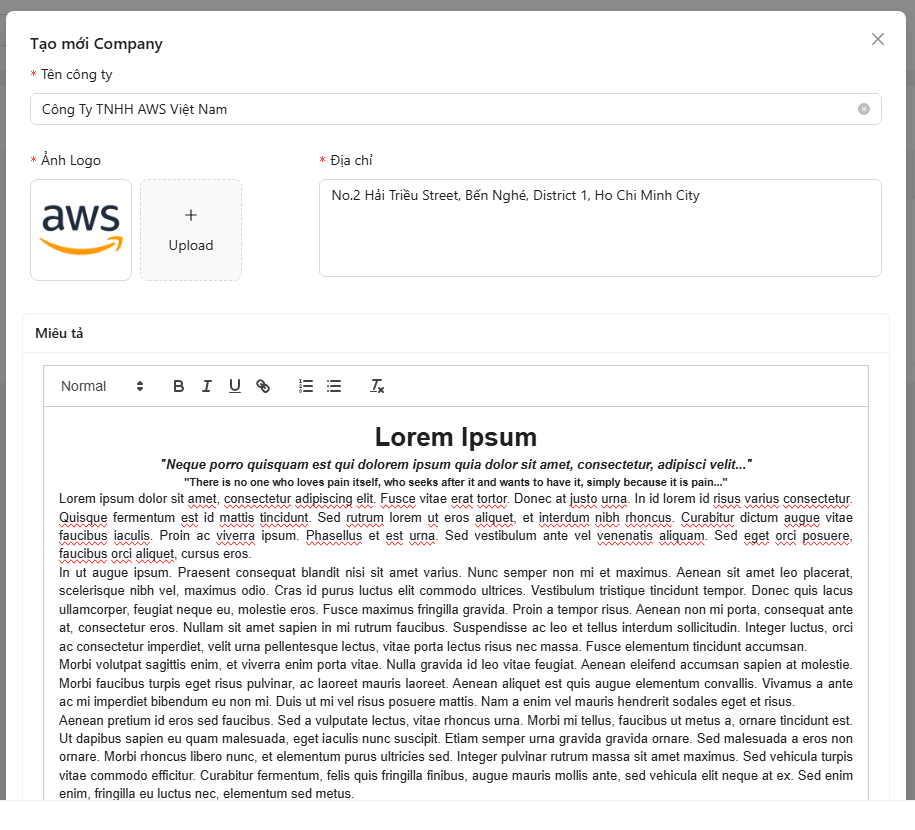
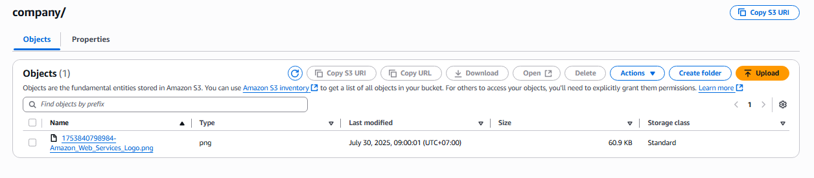
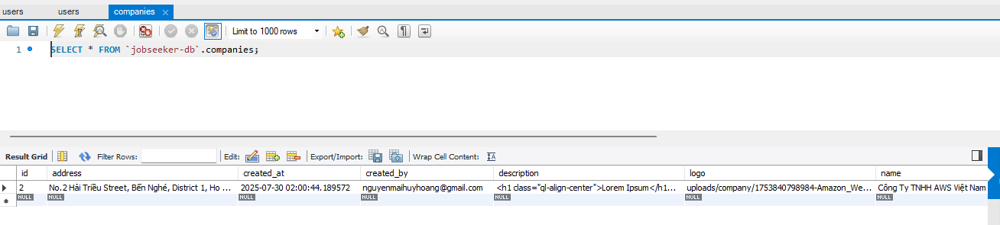

## Tạo một Company mới

1. Truy cập vào **Dashboard**, chọn tab **Company**.
2. Nhấn vào nút **Thêm mới**.
3. Nhập đầy đủ thông tin công ty và chọn hình ảnh, sau đó bấm **Tạo mới**.

   

4. Sau khi tạo thành công, thông tin công ty sẽ được hiển thị:

   

5. Quay lại trang chủ, bạn sẽ thấy công ty vừa tạo đã xuất hiện.

   

---

### Kiểm tra trên AWS S3

- Truy cập vào S3 Bucket để kiểm tra xem hình ảnh đã được lưu trữ thành công hay chưa.

  

✅ Hình ảnh đã được lưu trữ thành công trên S3.

---

### Kiểm tra trong cơ sở dữ liệu

- Trong bảng **Company**, dữ liệu được lưu kèm theo đường dẫn URL trỏ tới file hình ảnh trên S3 Bucket.

  

---

✅ Như vậy, chúng ta đã kiểm tra thành công tính năng lưu trữ hình ảnh trong dự án.

<strong>Note:</strong> 
Các tính năng khác cũng sẽ được thực hiện và kiểm tra tương tự.

