## Clean Up AWS Resources

We will clean up AWS resources in the following order:

---

### A. Delete Database Resources

#### 1. Delete the Database

1. Go to **Database instance**.
2. Click **Actions** → **Delete**.

   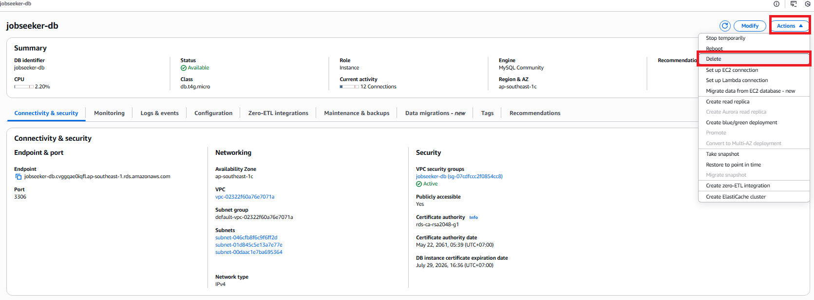

3. Confirm the delete action.

   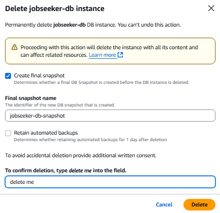

#### 2. Delete Snapshot

1. In the left navigation menu, go to the **Snapshots** tab.
2. Select the snapshot instance you want to delete.
3. Click **Actions** → **Delete snapshot**.

   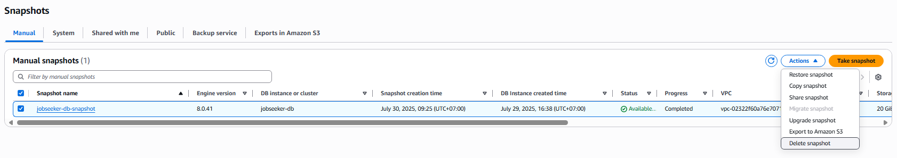

4. Confirm the **Delete** action.

   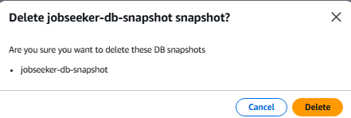

#### 3. Delete RDS Security Group

1. Go to **EC2** service → select **Security Groups**.
2. Select the Security Group created specifically for RDS.
3. Click **Actions** → **Delete security groups**.

   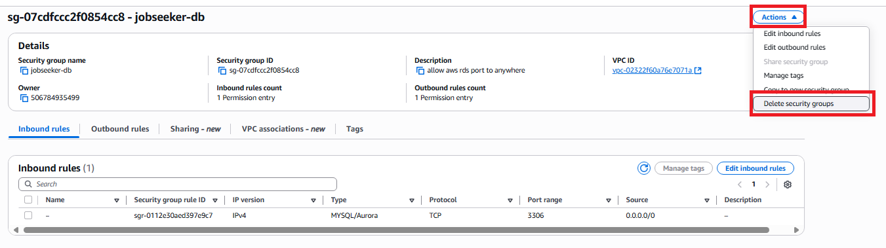

#### 4. Delete AWS Backup

1. Go to **AWS Backup** service → select **Backup plans**.
2. Select the Backup plan created specifically for RDS.
3. Click **Delete**

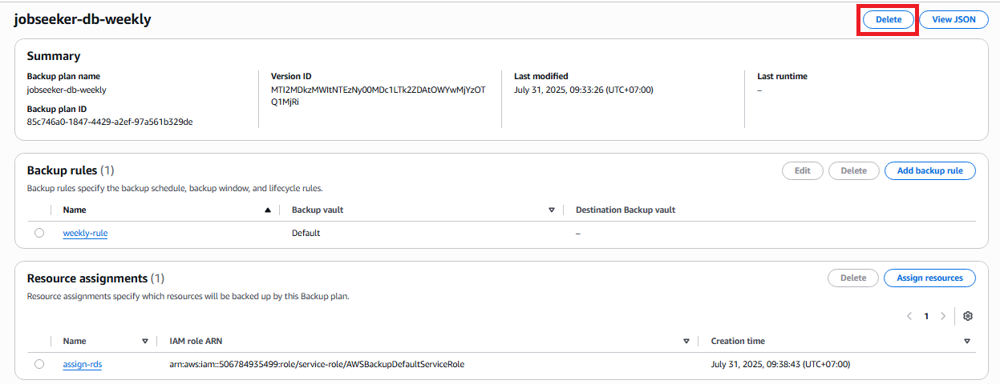

---

### B. Delete Elastic Beanstalk Resources

#### 1. Delete IAM Role

_(Manually remove if any IAM roles related to Elastic Beanstalk exist.)_

#### 2. Delete Elastic Beanstalk Application

1. Go to the **Elastic Beanstalk** service, then go to **Applications**.
2. Select the application to delete, then click **Actions** → **Delete application**.

   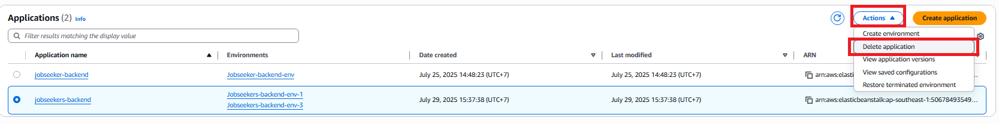

3. Confirm the deletion.

   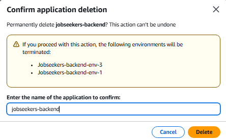

#### 3. Delete Elastic Beanstalk Security Group

1. Go to **EC2** → select **Security Groups**.
2. Choose the Security Group created for the Elastic Beanstalk environment.
3. Click **Actions** → **Delete security groups**.

   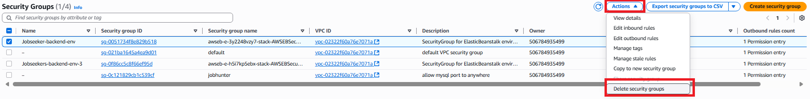

---

### C. Delete S3 and CloudFront Resources

#### 1. Delete S3 Bucket for Static Website

1. Go to the **S3** service.
2. Select the **S3 Bucket** that contains the static website assets.
3. Click **Empty bucket** to remove all data inside the bucket.

   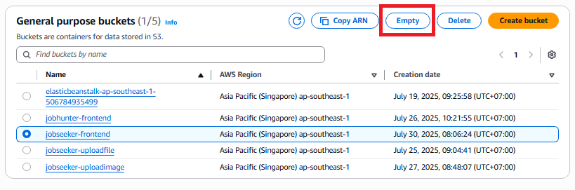

4. Confirm the data deletion.

   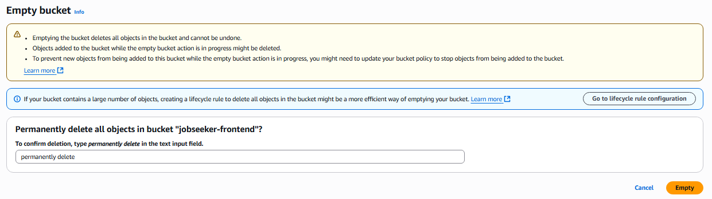

5. Proceed to delete the bucket.

   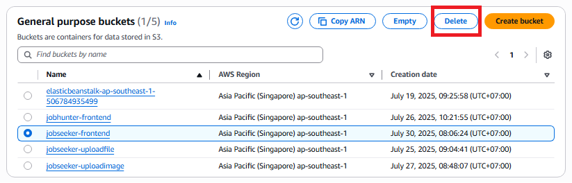

6. Confirm the bucket deletion.

   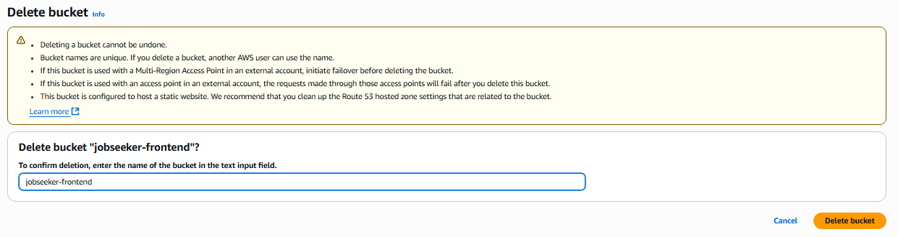

👉 Repeat the above steps to delete the S3 bucket used for image storage.

#### 2. Delete CloudFront Distribution

1. Go to the **CloudFront** service.
2. Select the **Distribution** to be deleted → click **Disable**.

   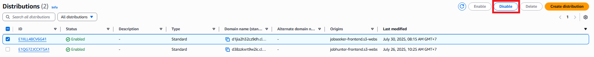

3. After some time (once the status changes to "Disabled"), click **Delete** to remove the distribution.

   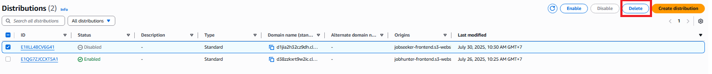

✅ So, we have completed the resource cleanup.
