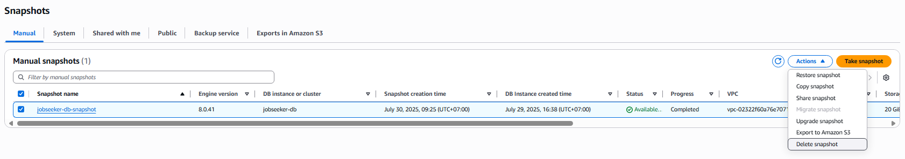
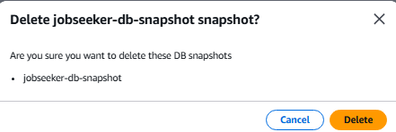
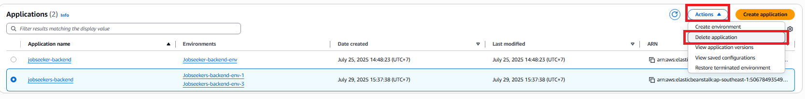
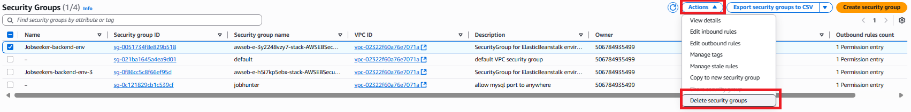
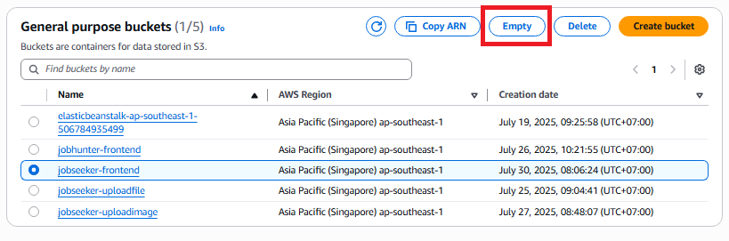
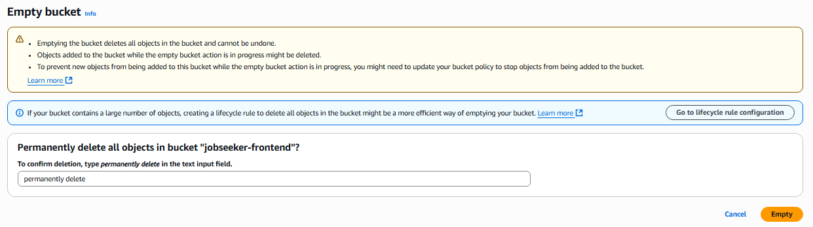
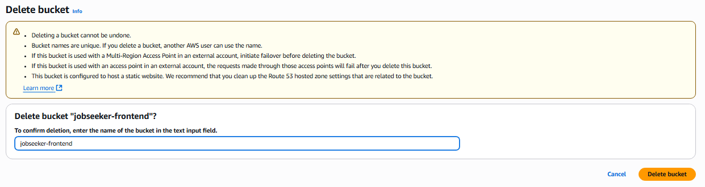
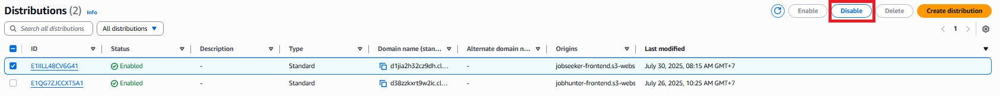
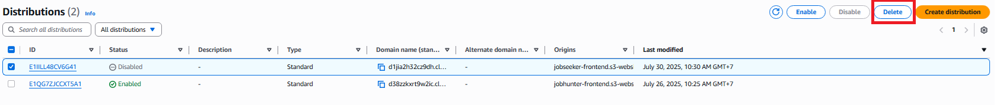

## Dọn dẹp các tài nguyên AWS

Chúng ta sẽ thực hiện dọn dẹp các tài nguyên AWS theo thứ tự sau:

---

### A. Xóa tài nguyên Database

#### 1. Xóa Database

1. Truy cập vào **Database instance**.
2. Chọn **Actions** → **Delete**.

   

3. Xác nhận thao tác xóa.

   

#### 2. Xóa Snapshot

1. Trong menu điều hướng bên trái, chọn tab **Snapshots**.
2. Chọn snapshot instance cần xóa.
3. Nhấn **Actions** → **Delete snapshot**.

   

4. Xác nhận thao tác **Xóa**.

   

#### 3. Xóa Security Group của RDS

1. Truy cập dịch vụ **EC2** → chọn **Security Groups**.
2. Chọn Security Group được tạo riêng cho RDS.
3. Nhấn **Actions** → **Delete security groups**.

   

#### 4. Xóa AWS Backup

1. Truy cập dịch vụ **AWS Backup** → chọn **Backup plans**.
2. Chọn Backup plan được tạo riêng cho RDS.
3. Chọn **Delete** để xóa

---

### B. Xóa tài nguyên Elastic Beanstalk

#### 1. Xóa IAM Role

_(Thực hiện thủ công theo yêu cầu nếu có IAM role liên quan đến Elastic Beanstalk.)_

#### 2. Xóa Elastic Beanstalk Application

1. Truy cập dịch vụ **Elastic Beanstalk**, chọn mục **Applications**.
2. Chọn ứng dụng cần xóa, sau đó nhấn **Actions** → **Delete application**.

   

3. Xác nhận thao tác xóa.

   

#### 3. Xóa Security Group của Elastic Beanstalk

1. Truy cập **EC2** → chọn **Security Groups**.
2. Chọn Security Group đã tạo riêng cho môi trường Elastic Beanstalk.
3. Nhấn **Actions** → **Delete security groups**.

   

---

### C. Xóa tài nguyên S3 và CloudFront

#### 1. Xóa S3 Bucket lưu web tĩnh

1. Truy cập dịch vụ **S3**.
2. Chọn **S3 Bucket** đang chứa tài nguyên web tĩnh.
3. Nhấn **Empty bucket** để xóa toàn bộ dữ liệu trong bucket.

   

4. Xác nhận thao tác xóa dữ liệu.

   

5. Thực hiện xóa bucket.

   

6. Xác nhận thao tác xóa bucket.

   

👉 Lặp lại các bước trên để xóa S3 bucket dùng để lưu trữ hình ảnh.

#### 2. Xóa CloudFront Distribution

1. Truy cập dịch vụ **CloudFront**.
2. Chọn **Distribution** cần xóa → nhấn **Disable**.

   

3. Sau một khoảng thời gian chờ đợi (khi trạng thái đã chuyển sang "Disabled"), nhấn **Delete** để xóa distribution.

   

✅ Như vậy, chúng ta đã hoàn tất việc dọn dẹp tài nguyên.
