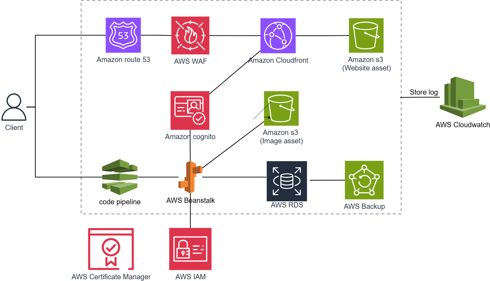

## Summary

In this workshop, we have built a modern web architecture on the AWS cloud computing platform. We have learned how to deploy applications with microservices architecture, security, and performance optimization. By using and combining key services such as CloudFront, S3, Beanstalk, and RDS, we clearly illustrated how system components work together to create a flexible, secure, and scalable architecture. The workshop not only helps consolidate foundational knowledge about AWS services but also equips skills to deploy a complete application environment that meets real-world operational requirements.

## Limitations

- The system has not been configured with **HTTPS**, leading to the risk of information exposure during data transmission between client and server.

- VPC endpoints have not been implemented and **private subnets** have not been fully deployed for all components, reducing the level of network isolation and security.

- The system deployment is still in single-zone configuration (single-AZ), without implementing **multi-AZ deployment**, affecting availability and fault tolerance.

- **CI/CD** automated deployment processes have not been integrated, application deployment is still performed manually, potentially introducing errors and lacking flexibility.

## Future Scope

In the future, we can expand the system architecture as shown in the following diagram:

**Amazon Route 53**

- Provides DNS (Domain Name System) services to help clients access through custom domain names.
- Since this service has high costs, consider carefully before using.

**AWS CodePipeline**

- Provides CI/CD services to automate the application deployment process.
- When source code changes (e.g., git push) → CodePipeline triggers build → deploys new application to AWS Beanstalk.

**Amazon Certificate Manager**

- Manage SSL/TLS certificates to encrypt traffic and set up HTTPS between client and server
- This certificate can be attached to AWS Beanstalk Elastic Load Balancer for more security.

**Amazon Cognito**

- Manages, authorizes, and authenticates user identities
- Users log in through Cognito → receive token → this token is used to access services like S3 (image assets) or call APIs running on Elastic Beanstalk.

**Amazon CloudWatch**

- Use CloudWatch to monitor the entire system architecture and collect logs, error alerts, etc.
- Example: when deploying to Beanstalk, S3. Logs will be sent to Cloudwatch.
