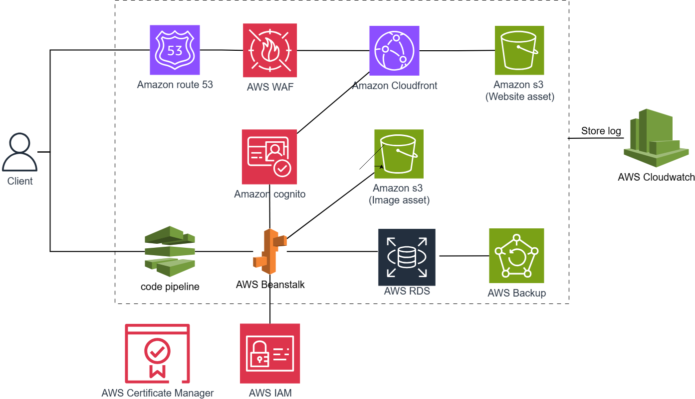

## Tổng kết

Trong workshop này, chúng ta đã xây dựng một kiến trúc web hiện đại trên nền tảng điện toán đám mấy AWS. Chúng ta đã học cách triển khai ứng dụng với kiến trúc microservices, bảo mật và tối ưu hóa hiệu năng. Nhờ sử dụng và kết hợp các dịch vụ chủ chốt như Cloudfront, S3, Beanstalk và RDS giúp minh họa rõ cách các thành phần trong hệ thống phối hợp để tạo nên một kiến trúc linh hoạt, bảo mật và dễ mở rộn. Workshop không chỉ giúp củng cố kiến thức nền tảng về các dịch vụ AWS mà còn trang bị kỹ năng triển khai một môi trường ứng dụng hoàn chỉnh đáp ứng các yêu cầu vận hành thực tế.

## Giới hạn

- Hệ thống chưa được cấu hình **HTTPS**, dẫn đến nguy cơ lộ thông tin trong quá trình truyền tải dữ liệu giữa client và server.

- Chưa áp dụng VPC endpoints và chưa triển khai đầy đủ **private subnets** cho tất cả các thành phần, làm giảm mức độ cách ly và bảo mật mạng.

- Triển khai hệ thống vẫn ở cấu hình đơn vùng (single-AZ), chưa thực hiện **multi-AZ deployment**, ảnh hưởng đến tính sẵn sàng và khả năng chịu lỗi.

- Chưa tích hợp quy trình tự động triển khai **(CI/CD)**, việc triển khai ứng dụng vẫn thực hiện thủ công, tiềm ẩn rủi ro sai sót và thiếu tính linh hoạt.

## Future scope

Trong tương lai, chúng ta có thể mở rộng hệ thống kiến trúc như hình sau:

**Amazon route 53**

- cung cấp dịch vụ DNS (Domain name system) để giúp client truy cập thông qua tên miền mình tự đặt.
- Vì dịch vụ này tính phí cao nên cân nhắc trước khi sử dụng.

**AWS Codepipline**

- Cung cấp dịch vụ CI/CD để tự động hóa quá trình triển khai ứng dụng.
- khi có mã nguồn thay đổi (ví dụ git push) -> CodePipeline kích hoạt build → deploy ứng dụng mới lên AWS Beanstalk.

**Amazon Certificate Manager**

- Quản lý SSL/TLS certificates để mã hóa lưu lượng và thiết lập HTTPS giữa client và server
- Có thể gắn certificate này vào Elastic Load Balancer của AWS Beanstalk để bảo mật hơn.

**Amazon Cognito**

- Quản lý, phân quyền và xác định danh tính người dùng
- Người dùng đăng nhập qua Cognito → nhận token → token này được dùng để truy cập vào các dịch vụ như S3 (image asset) hoặc gọi API chạy trên Elastic Beanstalk.

**Amazon CloudWatch**

- sử dụng Cloudwatch để giám sát toàn bộ kiến trúc hệ thống và thu thập log, cảnh báo lỗi ..
- vd: khi deploy lên Beanstalk, S3, thì các log sẽ được gửi về Cloudwatch.
