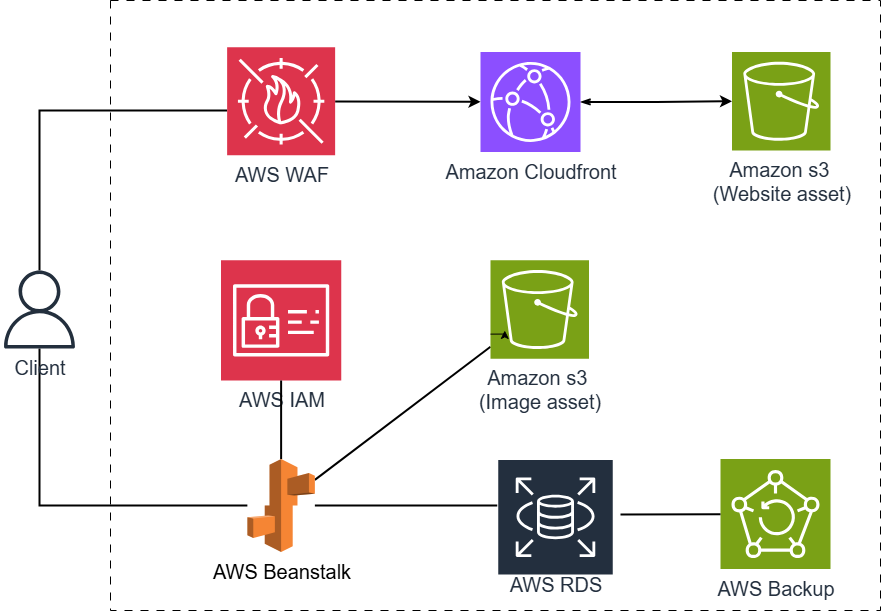

# Designing a Web App System Using Elastic Beanstalk and CloudFront

### Overview

In this lab, you will learn how to build a complete web application on the AWS cloud platform. The lab is practice-oriented, helping you get familiar with various AWS services through hands-on deployment steps.

Specifically, you will be guided to use:

- **Amazon S3**: Store static websites
- **Amazon RDS**: Host SQL databases
- **AWS Elastic Beanstalk**: Deploy and scale web applications
- **Amazon CloudFront**: Distribute content and secure access

The goal of this workshop is to help you understand how to deploy a real-world application system in the cloud environment.

---

### Estimated Cost

This workshop **does not incur any cost** as you will be using the **AWS Free Tier** (free for the first 12 months for new accounts), which includes access to basic AWS services.

---

### Estimated Time to Complete

The workshop is expected to take around **2–3 hours**, including hands-on practice using the AWS Console:

1. **Introduction (15–20 minutes)**:

   - Objectives
   - AWS Services
   - System Architecture

2. **Prerequisites (5–10 minutes)**:

   - AWS Account
   - IDE and development environment

3. **Deployment Practice (60–90 minutes)**:

   - Create the database
   - Deploy the backend
   - Build and deploy the frontend

4. **Resource Cleanup (15–20 minutes)**:
   - Delete all resources to avoid post-workshop charges

---

### Contents

1. [Introduction](1-introduce/)
2. [Prerequisites](2-prerequiste/)
3. [Database Design Using AWS RDS](3-create-database/)
4. [Deploy Backend with AWS Beanstalk](4-deploy-backend/)
5. [Build & Deploy Static Frontend](5-deploy-frontend/)
6. [Test Application Features](6-testing/)
7. [Clean Up Resources](7-cleanup/)
